# Página web La Caverna Del Dragón

## 👥 Miembros del Equipo
| Nombre y Apellidos | Correo URJC | Usuario GitHub |
|:--- |:--- |:--- |
| Carlos García Pérez | c.garciape.2016@alumnos.urjc.es | Scabfull |
| Antonio Martín Carrizosa | a.martinca.2023@alumnos.urjc.es | fishmanaym |
| Javier Cai Lin | j.cail.2016@alumnos.urjc.es | jcl4332 |
| Jaime Esteban García | j.esteban.2023@alumnos.urjc.es | jaimeeg5 |
| Anthony Lattanzi Salas | a.lattanzi.2023@alumnos.urjc.es | Ttnnyy04 |

---

## 🎭 **Preparación 1: Definición del Proyecto**

### **Descripción del Tema**
Página informativa de la asociación de estudiantes La Caverna del Dragón, donde se explica las noticias, eventos y juegos de la asociación.

### **Entidades**
Indicar las entidades principales que gestionará la aplicación y las relaciones entre ellas:

1. **Usuario**: puede ser usuario anónimo, usuario registrado o administrador.
2. **Evento**: evento creado por un usuario registrado al que se pueden apuntar los usuarios, cuenta con tags de categoría de evento, etc.
3. **Noticia**: noticia tipo blog que puede tener asignado un evento o no, pueden ser creadas por los usuarios registrados pero los administradores tienen que aceptarlas previamente, cuenta con tags de categoría de noticia, etc.
4. **Juego**: añadidos por los administradores. Los usuarios registrados pueden marcarlos como favoritos. 

**Relaciones entre entidades:**
- Evento - Usuario: Un evento puede tener apuntados múltiples usuarios y un usuario puede estar apuntado en múltiples eventos (N:M)
- Noticia - Evento: Una noticia puede contener múltiples eventos y un evento puede estar en múltiples noticias (N:M)
- Usuario - Juegos: Un usuario puede tener juegos favoritos y un juego puede ser asignado como favorito por múltiples usuarios (N:M)
- Evento - Usuario: Un evento pertenece a un usuario y un usuario puede ser dueño de múltiples eventos (N:1)

### **Permisos de los Usuarios**
Describir los permisos de cada tipo de usuario e indicar de qué entidades es dueño:

* **Usuario Anónimo**: 
  - Permisos: Visualización de noticias, eventos y juegos, apuntarte a eventos, registro, búsqueda de juegos, visualización de estadísticas
  - No es dueño de ninguna entidad

* **Usuario Registrado**: puede hacer todo lo que hace el usuario anónimo
  - Permisos: Gestión de perfil, ver eventos para usuarios registrados, marcar juego como favorito, gestión completa de sus eventos y noticias (CRUD)
  - Es dueño de: sus propios eventos, su perfil de usuario, sus juegos favoritos

* **Administrador**: puede hacer todo lo que hace el usuario registrado
  - Permisos: Gestión completa de todas las noticias, eventos y juegos (CRUD), moderación de contenido.
  - Es dueño de: Puede gestionar todos los Eventos, Noticias, Juegos y Usuarios.

### **Imágenes**
Indicar qué entidades tendrán asociadas una o varias imágenes:

- **Usuario**: foto de perfil
- **Juego**: foto del juego
- **Noticia**: múltiples fotos
- **Evento**: cartel del evento

### **Gráficos**
Indicar qué información se mostrará usando gráficos y de qué tipo serán:

- **Gráfico 1**: Juegos con más favoritos - Gráfico de barras
- **Gráfico 2**: Número de participantes en eventos - Gráfico de barras

### **Tecnología Complementaria**
Indicar qué tecnología complementaria se empleará:

- Envío de correos electrónicos automáticos mediante JavaMailSender. Se mandarán correos al registrarse, apuntarse en un evento, o al crearse un evento que le pueda interesar.

### **Algoritmo o Consulta Avanzada**
Indicar cuál será el algoritmo o consulta avanzada que se implementará:

- **Algoritmo/Consulta**: Sistema de recomendaciones basado en el historial de eventos apuntados
- **Descripción**: Analiza los eventos apuntados previamente y sugiere eventos con el mismo tag mediante correo

- **Algoritmo/Consulta**: Algoritmo de búsqueda 
- **Descripción**: Permite buscar eventos o noticias por tags y otros atributos como el nombre.

---

## 🛠 **Preparación 2: Maquetación de páginas con HTML y CSS**

### **Vídeo de Demostración**
📹 **[Enlace al vídeo en YouTube](https://www.youtube.com/watch?v=Y9yXVcRtgFs)**
> Vídeo mostrando las principales funcionalidades de la aplicación web.

### **Diagrama de Navegación**
Diagrama que muestra cómo se navega entre las diferentes páginas de la aplicación:

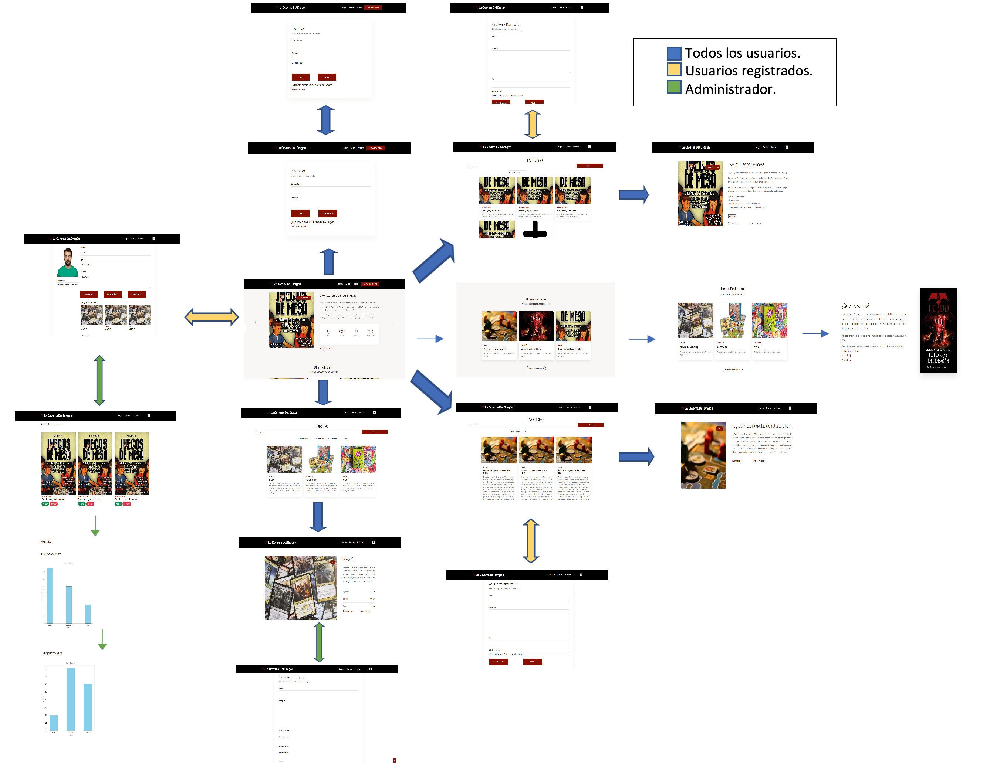

> El usuario puede acceder desde la página principal a todas las secciones mediante el menú de navegación. Los usuarios anónimos solo tienen acceso a las páginas públicas, mientras que los registrados pueden acceder a su perfil y panel de usuario y los administradores pueden aceptar o denegar las solicitudesde eventos y/o noticias desde el perfil.

### **Capturas de Pantalla y Descripción de Páginas**

#### **1. Página Principal / Home**
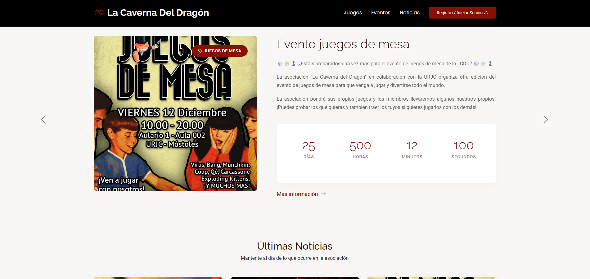


> Página de inicio que muestra el evento destacado, categorías principales y un banner promocional. Incluye barra de navegación y acceso a registro/login para usuarios no autenticados.

#### **2. Página Inicio de sesión / Login**
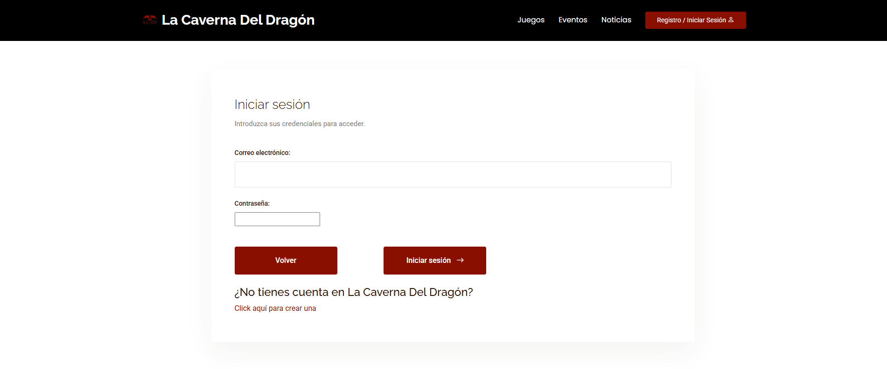


> Página de inicio de sesión en el cual el usuario anónimo podrá introducir sus credenciales para poder iniciar sesión y si no tiene una cuenta lo puede crear redirigiendolo

#### **3. Página Resgistro / Resgister**
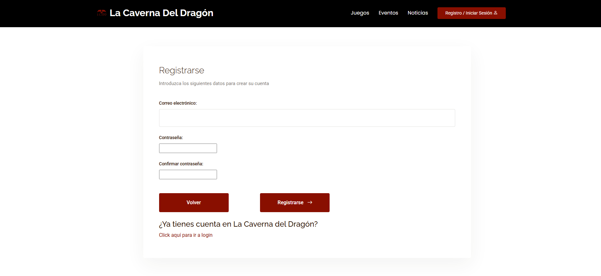


> Página de registro en el cual el usuario anónimo podrá introducir sus datos para poder crear una cuenta y si ya tiene cuenta puede redirigirse a iniciar sesión

#### **4. Página Perfil / Profile**
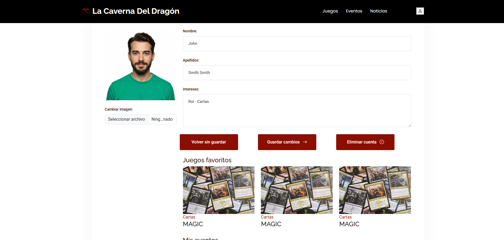


> Página del perfil del usuario registrado en el cual el usuario podrá modificar sus datos, ver sus eventos y noticias creadas y sus juegos favoritos

#### **5. Página Admninistrador / Admin**
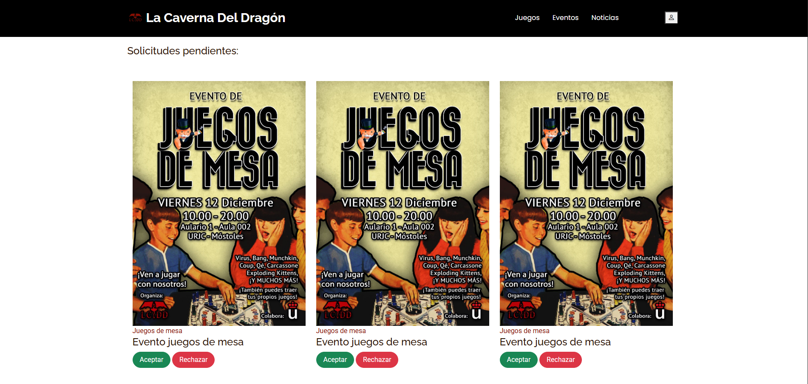


> Página del administrador en el cual un usuario administrador puede ver todas las solicitudes de eventos y noticias pendientes de validar junto a varias gráficas como las de los juegos favoritos y la de los eventos con mas inscripciones

#### **6. Página Principal Eventos / Main Events**
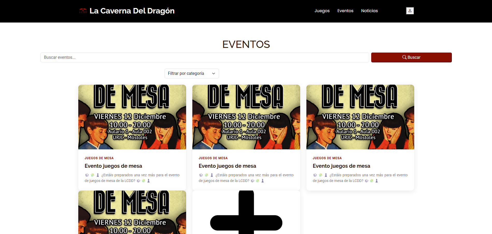


> Página principal de los eventos en el cual el usuario anónimo podrá ver todos los eventos realizados y a realizar de la asociación, junto con un buscador para filtrar eventos

#### **7. Página Principal Noticias / Main News**
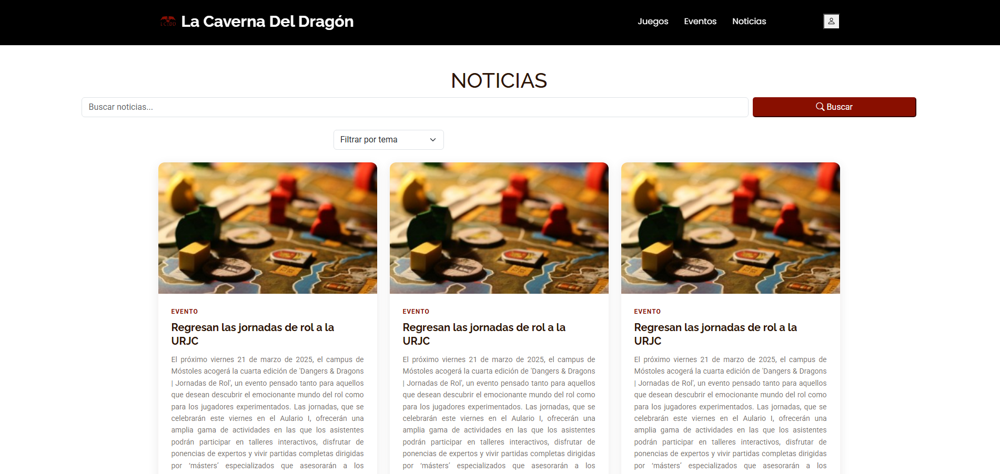


> Página principal de las noticias en el cual el usuario anónimo podrá ver todas las noticias publicadas, junto con un buscador para filtrar noticias

#### **8. Página Principal Juegos / Main Game**
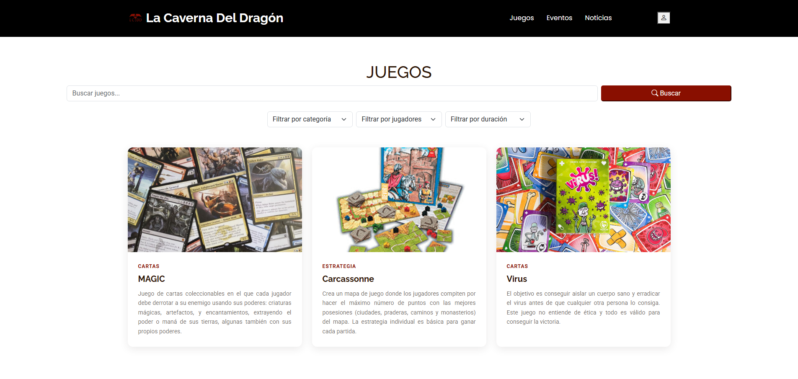


> Página principal de juegos donde el usuario anónimo podrá ver todos los juegos disponibles junto a un buscador para filtrar juegos

#### **9. Página Evento / Event**
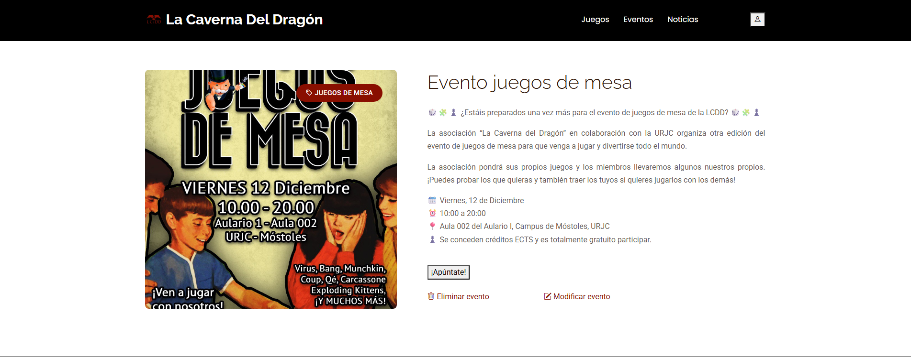


> Página de un evento en concreto en el cual el usuario anónimo o registrado podrá apuntarse

#### **10. Página Noticia / News**
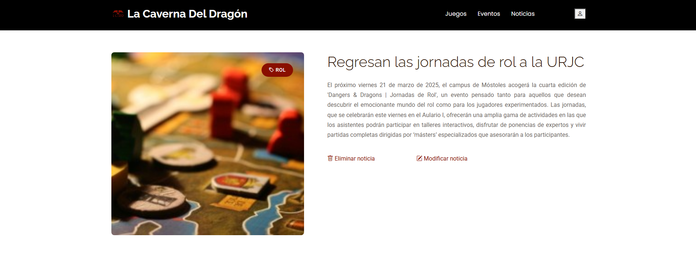


> Página de una noticia en concreto en el cual el usuario anónimo o registrado podrá leer su contenido

#### **11. Página Juego / Game**
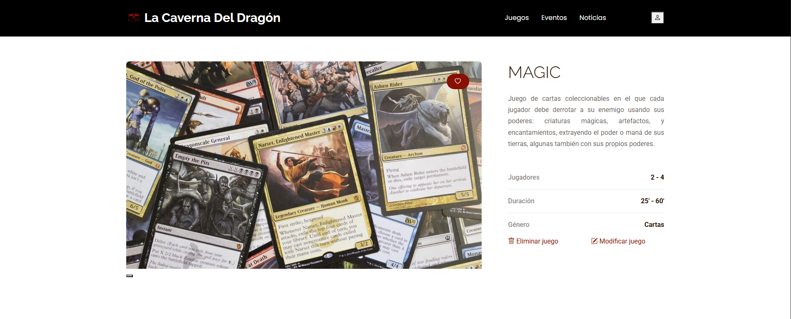


> Página de un juego en concreto en el cual el usuario anónimo podrá ver su descripción y el usuario registrado podrá añadirlo como juego favorito

#### **12. Página Modificación Eventos / Modify Events**
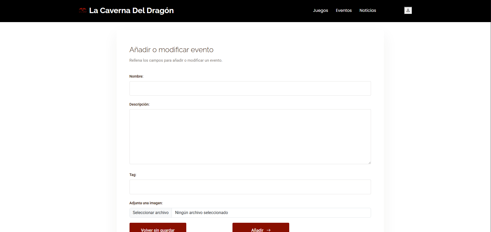


> Página de modificación o creación de eventos en el cual el usuario administrador o creador de dicho evento puede modificar o crear eventos

#### **13. Página Modificación Noticias / Modify News**
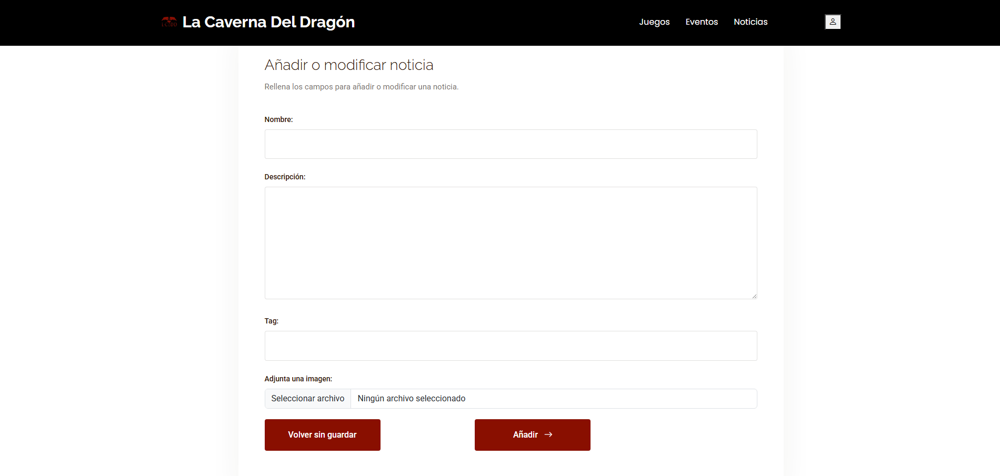


> Página de modificación o creación de noticias en el cual el usuario administrador o creador de dicha noticia puede modificar o crear noticias

#### **14. Página Modificación Juegos / Modify Game**
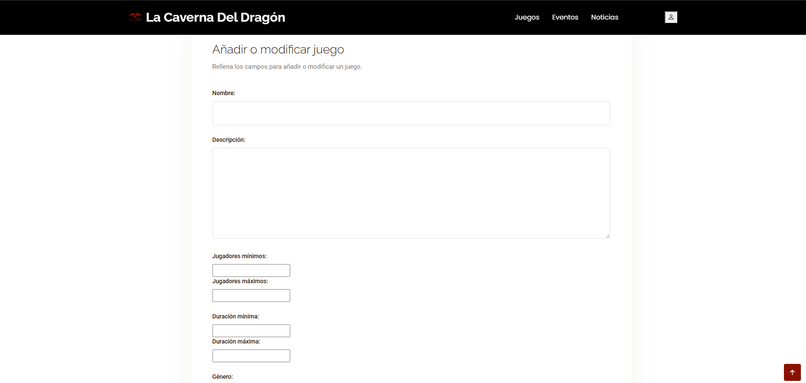


> Página de modificación o creación de juegos en el cual el usuario administrador puede modificar o añadir juegos


## 🛠 **Práctica 1: Web con HTML generado en servidor y AJAX**

### **Vídeo de Demostración**
📹 **[Enlace al vídeo en YouTube](https://www.youtube.com/watch?v=x91MPoITQ3I)**
> Vídeo mostrando las principales funcionalidades de la aplicación web.

### **Navegación y Capturas de Pantalla**

#### **Diagrama de Navegación**

Solo si ha cambiado.

#### **Capturas de Pantalla Actualizadas**

Solo si han cambiado.

### **Instrucciones de Ejecución**

#### **Requisitos Previos**
- **Java**: versión 21 o superior
- **Maven**: versión 3.8 o superior
- **MySQL**: versión 8.0 o superior
- **Git**: para clonar el repositorio

#### **Pasos para ejecutar la aplicación**

1. **Clonar el repositorio**
   ```bash
   git clone https://github.com/[usuario]/[nombre-repositorio].git
   cd [nombre-repositorio]
   ```

2. **AQUÍ INDICAR LO SIGUIENTES PASOS**

#### **Credenciales de prueba**
- **Usuario Admin**: usuario: `admin`, contraseña: `admin`
- **Usuario Registrado**: usuario: `user`, contraseña: `user`

### **Diagrama de Entidades de Base de Datos**

Diagrama mostrando las entidades, sus campos y relaciones:


> [Descripción opcional: Ej: "El diagrama muestra las 4 entidades principales: Usuario, Producto, Pedido y Categoría, con sus respectivos atributos y relaciones 1:N y N:M."]

### **Diagrama de Clases y Templates**

Diagrama de clases de la aplicación con diferenciación por colores o secciones:


> [Descripción opcional del diagrama y relaciones principales]

### **Participación de Miembros en la Práctica 1**

#### **Alumno 1 - [Nombre Completo]**

[Descripción de las tareas y responsabilidades principales del alumno en el proyecto]

| Nº    | Commits      | Files      |
|:------------: |:------------:| :------------:|
|1| [Descripción commit 1](URL_commit_1)  | [Archivo1](URL_archivo_1)   |
|2| [Descripción commit 2](URL_commit_2)  | [Archivo2](URL_archivo_2)   |
|3| [Descripción commit 3](URL_commit_3)  | [Archivo3](URL_archivo_3)   |
|4| [Descripción commit 4](URL_commit_4)  | [Archivo4](URL_archivo_4)   |
|5| [Descripción commit 5](URL_commit_5)  | [Archivo5](URL_archivo_5)   |

---

#### **Alumno 2 - [Nombre Completo]**

[Descripción de las tareas y responsabilidades principales del alumno en el proyecto]

| Nº    | Commits      | Files      |
|:------------: |:------------:| :------------:|
|1| [Descripción commit 1](URL_commit_1)  | [Archivo1](URL_archivo_1)   |
|2| [Descripción commit 2](URL_commit_2)  | [Archivo2](URL_archivo_2)   |
|3| [Descripción commit 3](URL_commit_3)  | [Archivo3](URL_archivo_3)   |
|4| [Descripción commit 4](URL_commit_4)  | [Archivo4](URL_archivo_4)   |
|5| [Descripción commit 5](URL_commit_5)  | [Archivo5](URL_archivo_5)   |

---

#### **Alumno 3 - Javier Cai Lin**

Implementar las funciones de la pagina del administrador que seria: implementar la funcionalidad de las gráficas de juegos favoritos y eventos con mas participantes, creación de la lista de usuarios de la aplicación, validación por parte del administrador a la hora de crear eventos y noticias nuevas y funcionalidades sueltas como la de implementar la funcion de añadir juegos favoritos de un usuario y el ocultar los botones de edicion de los perfiles que no sea del usuario que ha iniciado sesion o administrador

| Nº    | Commits      | Files      |
|:------------: |:------------:| :------------:|
|1| [Se añade la gráfica para los juegos con mas favoritos](https://github.com/CodeURJC-DAW-2025-26/practica-daw-2025-26-grupo-6/commit/d0faf5f6822f81af011612bcf3faeb20b962196e)  | [admin.html](https://github.com/CodeURJC-DAW-2025-26/practica-daw-2025-26-grupo-6/blame/main/lcdd-daw/src/main/resources/templates/admin.html)   |
|2| [Se añade la gráfica para los eventos con mas participantes](https://github.com/CodeURJC-DAW-2025-26/practica-daw-2025-26-grupo-6/commit/b5f656c23c73100f9464c218e827c29e6640e383)  | [AdministrationController.java
](https://github.com/CodeURJC-DAW-2025-26/practica-daw-2025-26-grupo-6/blame/main/lcdd-daw/src/main/java/com/grupo6daw/lcdd_daw/controller/AdministrationController.java)   |
|3| [Implementado la funcionalidad de solo mostrar los eventos validados al público y los no validados en la pagina de administrador](https://github.com/CodeURJC-DAW-2025-26/practica-daw-2025-26-grupo-6/commit/f0d45a70079127e8f5d76e5b71524f962e4c9c69)  | [UserController.java](https://github.com/CodeURJC-DAW-2025-26/practica-daw-2025-26-grupo-6/blame/main/lcdd-daw/src/main/java/com/grupo6daw/lcdd_daw/controller/UserController.java)   |
|4| [Implementado la funcionalidad de solo mostrar las notiicas validadas al público y las no validadas en la pagina de administrador](https://github.com/CodeURJC-DAW-2025-26/practica-daw-2025-26-grupo-6/commit/ac6bb5b72aab14e40f5b18683f266109df8a0c35)  | [EventsController.java
](https://github.com/CodeURJC-DAW-2025-26/practica-daw-2025-26-grupo-6/blame/main/lcdd-daw/src/main/java/com/grupo6daw/lcdd_daw/controller/EventsController.java)   |
|5| [Implementado la lista de usuarios registrados en la pagina de administrador](https://github.com/CodeURJC-DAW-2025-26/practica-daw-2025-26-grupo-6/commit/32fb70885150892eaaa6b9537ccc871ff8f12f31)  | [profile.html
](https://github.com/CodeURJC-DAW-2025-26/practica-daw-2025-26-grupo-6/blame/main/lcdd-daw/src/main/resources/templates/profile.html)   |

---

#### **Alumno 4 - [Nombre Completo]**

[Descripción de las tareas y responsabilidades principales del alumno en el proyecto]

| Nº    | Commits      | Files      |
|:------------: |:------------:| :------------:|
|1| [Descripción commit 1](URL_commit_1)  | [Archivo1](URL_archivo_1)   |
|2| [Descripción commit 2](URL_commit_2)  | [Archivo2](URL_archivo_2)   |
|3| [Descripción commit 3](URL_commit_3)  | [Archivo3](URL_archivo_3)   |
|4| [Descripción commit 4](URL_commit_4)  | [Archivo4](URL_archivo_4)   |
|5| [Descripción commit 5](URL_commit_5)  | [Archivo5](URL_archivo_5)   |

---

## 🛠 **Práctica 2: Incorporación de una API REST a la aplicación web, despliegue con Docker y despliegue remoto**

### **Vídeo de Demostración**
📹 **[Enlace al vídeo en YouTube](https://www.youtube.com/watch?v=x91MPoITQ3I)**
> Vídeo mostrando las principales funcionalidades de la aplicación web.

### **Documentación de la API REST**

#### **Especificación OpenAPI**
📄 **[Especificación OpenAPI (YAML)](/api-docs/api-docs.yaml)**

#### **Documentación HTML**
📖 **[Documentación API REST (HTML)](https://raw.githack.com/[usuario]/[repositorio]/main/api-docs/api-docs.html)**

> La documentación de la API REST se encuentra en la carpeta `/api-docs` del repositorio. Se ha generado automáticamente con SpringDoc a partir de las anotaciones en el código Java.

### **Diagrama de Clases y Templates Actualizado**

Diagrama actualizado incluyendo los @RestController y su relación con los @Service compartidos:


### **Instrucciones de Ejecución con Docker**

#### **Requisitos previos:**
- Docker instalado (versión 20.10 o superior)
- Docker Compose instalado (versión 2.0 o superior)

#### **Pasos para ejecutar con docker-compose:**

1. **Clonar el repositorio** (si no lo has hecho ya):
   ```bash
   git clone https://github.com/[usuario]/[repositorio].git
   cd [repositorio]
   ```

2. **AQUÍ LOS SIGUIENTES PASOS**:

### **Construcción de la Imagen Docker**

#### **Requisitos:**
- Docker instalado en el sistema

#### **Pasos para construir y publicar la imagen:**

1. **Navegar al directorio de Docker**:
   ```bash
   cd docker
   ```

2. **AQUÍ LOS SIGUIENTES PASOS**

### **Despliegue en Máquina Virtual**

#### **Requisitos:**
- Acceso a la máquina virtual (SSH)
- Clave privada para autenticación
- Conexión a la red correspondiente o VPN configurada

#### **Pasos para desplegar:**

1. **Conectar a la máquina virtual**:
   ```bash
   ssh -i [ruta/a/clave.key] [usuario]@[IP-o-dominio-VM]
   ```
   
   Ejemplo:
   ```bash
   ssh -i ssh-keys/app.key vmuser@10.100.139.XXX
   ```

2. **AQUÍ LOS SIGUIENTES PASOS**:

### **URL de la Aplicación Desplegada**

🌐 **URL de acceso**: `https://[nombre-app].etsii.urjc.es:8443`

#### **Credenciales de Usuarios de Ejemplo**

| Rol | Usuario | Contraseña |
|:---|:---|:---|
| Administrador | admin | admin123 |
| Usuario Registrado | user1 | user123 |
| Usuario Registrado | user2 | user123 |

### **Participación de Miembros en la Práctica 2**

#### **Alumno 1 - [Nombre Completo]**

[Descripción de las tareas y responsabilidades principales del alumno en el proyecto]

| Nº    | Commits      | Files      |
|:------------: |:------------:| :------------:|
|1| [Descripción commit 1](URL_commit_1)  | [Archivo1](URL_archivo_1)   |
|2| [Descripción commit 2](URL_commit_2)  | [Archivo2](URL_archivo_2)   |
|3| [Descripción commit 3](URL_commit_3)  | [Archivo3](URL_archivo_3)   |
|4| [Descripción commit 4](URL_commit_4)  | [Archivo4](URL_archivo_4)   |
|5| [Descripción commit 5](URL_commit_5)  | [Archivo5](URL_archivo_5)   |

---

#### **Alumno 2 - [Nombre Completo]**

[Descripción de las tareas y responsabilidades principales del alumno en el proyecto]

| Nº    | Commits      | Files      |
|:------------: |:------------:| :------------:|
|1| [Descripción commit 1](URL_commit_1)  | [Archivo1](URL_archivo_1)   |
|2| [Descripción commit 2](URL_commit_2)  | [Archivo2](URL_archivo_2)   |
|3| [Descripción commit 3](URL_commit_3)  | [Archivo3](URL_archivo_3)   |
|4| [Descripción commit 4](URL_commit_4)  | [Archivo4](URL_archivo_4)   |
|5| [Descripción commit 5](URL_commit_5)  | [Archivo5](URL_archivo_5)   |

---

#### **Alumno 3 - [Nombre Completo]**

[Descripción de las tareas y responsabilidades principales del alumno en el proyecto]

| Nº    | Commits      | Files      |
|:------------: |:------------:| :------------:|
|1| [Descripción commit 1](URL_commit_1)  | [Archivo1](URL_archivo_1)   |
|2| [Descripción commit 2](URL_commit_2)  | [Archivo2](URL_archivo_2)   |
|3| [Descripción commit 3](URL_commit_3)  | [Archivo3](URL_archivo_3)   |
|4| [Descripción commit 4](URL_commit_4)  | [Archivo4](URL_archivo_4)   |
|5| [Descripción commit 5](URL_commit_5)  | [Archivo5](URL_archivo_5)   |

---

#### **Alumno 4 - [Nombre Completo]**

[Descripción de las tareas y responsabilidades principales del alumno en el proyecto]

| Nº    | Commits      | Files      |
|:------------: |:------------:| :------------:|
|1| [Descripción commit 1](URL_commit_1)  | [Archivo1](URL_archivo_1)   |
|2| [Descripción commit 2](URL_commit_2)  | [Archivo2](URL_archivo_2)   |
|3| [Descripción commit 3](URL_commit_3)  | [Archivo3](URL_archivo_3)   |
|4| [Descripción commit 4](URL_commit_4)  | [Archivo4](URL_archivo_4)   |
|5| [Descripción commit 5](URL_commit_5)  | [Archivo5](URL_archivo_5)   |

---

## 🛠 **Práctica 3: Implementación de la web con arquitectura SPA**

### **Vídeo de Demostración**
📹 **[Enlace al vídeo en YouTube](URL_del_video)**
> Vídeo mostrando las principales funcionalidades de la aplicación web.

### **Preparación del Entorno de Desarrollo**

#### **Requisitos Previos**
- **Node.js**: versión 18.x o superior
- **npm**: versión 9.x o superior (se instala con Node.js)
- **Git**: para clonar el repositorio

#### **Pasos para configurar el entorno de desarrollo**

1. **Instalar Node.js y npm**
   
   Descarga e instala Node.js desde [https://nodejs.org/](https://nodejs.org/)
   
   Verifica la instalación:
   ```bash
   node --version
   npm --version
   ```

2. **Clonar el repositorio** (si no lo has hecho ya)
   ```bash
   git clone https://github.com/[usuario]/[nombre-repositorio].git
   cd [nombre-repositorio]
   ```

3. **Navegar a la carpeta del proyecto React**
   ```bash
   cd frontend
   ```

4. **AQUÍ LOS SIGUIENTES PASOS**

### **Diagrama de Clases y Templates de la SPA**

Diagrama mostrando los componentes React, hooks personalizados, servicios y sus relaciones:


### **Participación de Miembros en la Práctica 3**

#### **Alumno 1 - [Nombre Completo]**

[Descripción de las tareas y responsabilidades principales del alumno en el proyecto]

| Nº    | Commits      | Files      |
|:------------: |:------------:| :------------:|
|1| [Descripción commit 1](URL_commit_1)  | [Archivo1](URL_archivo_1)   |
|2| [Descripción commit 2](URL_commit_2)  | [Archivo2](URL_archivo_2)   |
|3| [Descripción commit 3](URL_commit_3)  | [Archivo3](URL_archivo_3)   |
|4| [Descripción commit 4](URL_commit_4)  | [Archivo4](URL_archivo_4)   |
|5| [Descripción commit 5](URL_commit_5)  | [Archivo5](URL_archivo_5)   |

---

#### **Alumno 2 - [Nombre Completo]**

[Descripción de las tareas y responsabilidades principales del alumno en el proyecto]

| Nº    | Commits      | Files      |
|:------------: |:------------:| :------------:|
|1| [Descripción commit 1](URL_commit_1)  | [Archivo1](URL_archivo_1)   |
|2| [Descripción commit 2](URL_commit_2)  | [Archivo2](URL_archivo_2)   |
|3| [Descripción commit 3](URL_commit_3)  | [Archivo3](URL_archivo_3)   |
|4| [Descripción commit 4](URL_commit_4)  | [Archivo4](URL_archivo_4)   |
|5| [Descripción commit 5](URL_commit_5)  | [Archivo5](URL_archivo_5)   |

---

#### **Alumno 3 - [Nombre Completo]**

[Descripción de las tareas y responsabilidades principales del alumno en el proyecto]

| Nº    | Commits      | Files      |
|:------------: |:------------:| :------------:|
|1| [Descripción commit 1](URL_commit_1)  | [Archivo1](URL_archivo_1)   |
|2| [Descripción commit 2](URL_commit_2)  | [Archivo2](URL_archivo_2)   |
|3| [Descripción commit 3](URL_commit_3)  | [Archivo3](URL_archivo_3)   |
|4| [Descripción commit 4](URL_commit_4)  | [Archivo4](URL_archivo_4)   |
|5| [Descripción commit 5](URL_commit_5)  | [Archivo5](URL_archivo_5)   |

---

#### **Alumno 4 - [Nombre Completo]**

[Descripción de las tareas y responsabilidades principales del alumno en el proyecto]

| Nº    | Commits      | Files      |
|:------------: |:------------:| :------------:|
|1| [Descripción commit 1](URL_commit_1)  | [Archivo1](URL_archivo_1)   |
|2| [Descripción commit 2](URL_commit_2)  | [Archivo2](URL_archivo_2)   |
|3| [Descripción commit 3](URL_commit_3)  | [Archivo3](URL_archivo_3)   |
|4| [Descripción commit 4](URL_commit_4)  | [Archivo4](URL_archivo_4)   |
|5| [Descripción commit 5](URL_commit_5)  | [Archivo5](URL_archivo_5)   |

