# Página web La Caverna Del Dragón

## 👥 Miembros del Equipo
| Nombre y Apellidos | Correo URJC | Usuario GitHub |
|:--- |:--- |:--- |
| Carlos García Pérez | c.garciape.2016@alumnos.urjc.es | Scabfull |
| Antonio Martín Carrizosa | a.martinca.2023@alumnos.urjc.es | fishmanaym |
| Javier Cai Lin | j.cail.2016@alumnos.urjc.es | jcl4332 |
| Jaime Esteban García | j.esteban.2023@alumnos.urjc.es | jaimeeg5 |
| Anthony Lattanzi Salas | a.lattanzi.2023@alumnos.urjc.es | Ttnnyy04 |

---

## 🎭 **Preparación 1: Definición del Proyecto**

### **Descripción del Tema**
Página informativa de la asociación de estudiantes La Caverna del Dragón, donde se explica las noticias, eventos y juegos de la asociación.

### **Entidades**
Indicar las entidades principales que gestionará la aplicación y las relaciones entre ellas:

1. **Usuario**: puede ser usuario anónimo, usuario registrado o administrador.
2. **Evento**: evento creado por un usuario registrado al que se pueden apuntar los usuarios, cuenta con tags de categoría de evento, etc.
3. **Noticia**: noticia tipo blog que puede tener asignado un evento o no, pueden ser creadas por los usuarios registrados pero los administradores tienen que aceptarlas previamente, cuenta con tags de categoría de noticia, etc.
4. **Juego**: añadidos por los administradores. Los usuarios registrados pueden marcarlos como favoritos. 

**Relaciones entre entidades:**
- Evento - Usuario: Un evento puede tener apuntados múltiples usuarios y un usuario puede estar apuntado en múltiples eventos (N:M)
- Noticia - Evento: Una noticia puede contener múltiples eventos y un evento puede estar en múltiples noticias (N:M)
- Usuario - Juegos: Un usuario puede tener juegos favoritos y un juego puede ser asignado como favorito por múltiples usuarios (N:M)
- Evento - Usuario: Un evento pertenece a un usuario y un usuario puede ser dueño de múltiples eventos (N:1)

### **Permisos de los Usuarios**
Describir los permisos de cada tipo de usuario e indicar de qué entidades es dueño:

* **Usuario Anónimo**: 
  - Permisos: Visualización de noticias, eventos y juegos, apuntarte a eventos, registro, búsqueda de juegos, visualización de estadísticas
  - No es dueño de ninguna entidad

* **Usuario Registrado**: puede hacer todo lo que hace el usuario anónimo
  - Permisos: Gestión de perfil, ver eventos para usuarios registrados, marcar juego como favorito, gestión completa de sus eventos y noticias (CRUD)
  - Es dueño de: sus propios eventos, su perfil de usuario, sus juegos favoritos

* **Administrador**: puede hacer todo lo que hace el usuario registrado
  - Permisos: Gestión completa de todas las noticias, eventos y juegos (CRUD), moderación de contenido.
  - Es dueño de: Puede gestionar todos los Eventos, Noticias, Juegos y Usuarios.

### **Imágenes**
Indicar qué entidades tendrán asociadas una o varias imágenes:

- **Usuario**: foto de perfil
- **Juego**: foto del juego
- **Noticia**: múltiples fotos
- **Evento**: cartel del evento

### **Gráficos**
Indicar qué información se mostrará usando gráficos y de qué tipo serán:

- **Gráfico 1**: Juegos con más favoritos - Gráfico de barras
- **Gráfico 2**: Número de participantes en eventos - Gráfico de barras

### **Tecnología Complementaria**
Indicar qué tecnología complementaria se empleará:

- Envío de correos electrónicos automáticos mediante JavaMailSender. Se mandarán correos al registrarse, apuntarse en un evento, o al crearse un evento que le pueda interesar.

### **Algoritmo o Consulta Avanzada**
Indicar cuál será el algoritmo o consulta avanzada que se implementará:

- **Algoritmo/Consulta**: Sistema de recomendaciones basado en el historial de eventos apuntados
- **Descripción**: Analiza los eventos apuntados previamente y sugiere eventos con el mismo tag mediante correo

- **Algoritmo/Consulta**: Algoritmo de búsqueda 
- **Descripción**: Permite buscar eventos o noticias por tags y otros atributos como el nombre.

---

## 🛠 **Preparación 2: Maquetación de páginas con HTML y CSS**

### **Vídeo de Demostración**
📹 **[Enlace al vídeo en YouTube](https://www.youtube.com/watch?v=Y9yXVcRtgFs)**
> Vídeo mostrando las principales funcionalidades de la aplicación web.

### **Diagrama de Navegación**
Diagrama que muestra cómo se navega entre las diferentes páginas de la aplicación:

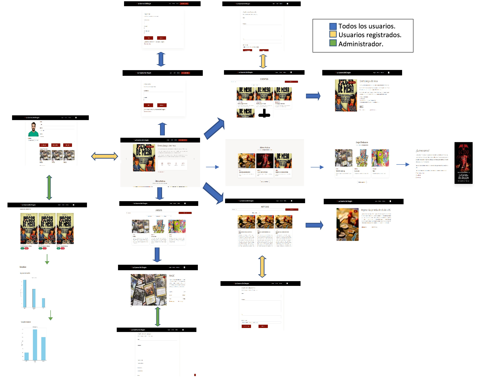

> El usuario puede acceder desde la página principal a todas las secciones mediante el menú de navegación. Los usuarios anónimos solo tienen acceso a las páginas públicas, mientras que los registrados pueden acceder a su perfil y panel de usuario y los administradores pueden aceptar o denegar las solicitudesde eventos y/o noticias desde el perfil.

### **Capturas de Pantalla y Descripción de Páginas**

#### **1. Página Principal / Home**
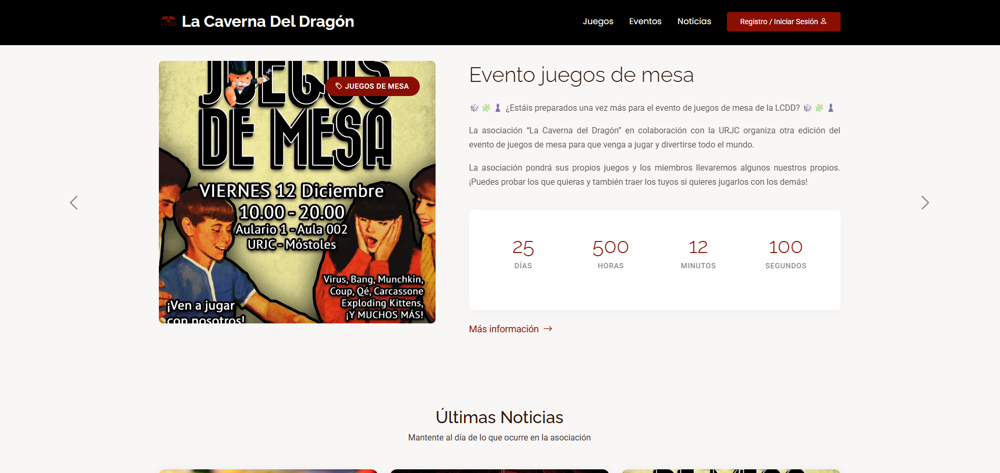


> Página de inicio que muestra el evento destacado, categorías principales y un banner promocional. Incluye barra de navegación y acceso a registro/login para usuarios no autenticados.

#### **2. Página Inicio de sesión / Login**
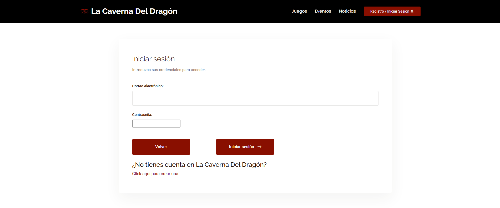


> Página de inicio de sesión en el cual el usuario anónimo podrá introducir sus credenciales para poder iniciar sesión y si no tiene una cuenta lo puede crear redirigiendolo

#### **3. Página Resgistro / Resgister**
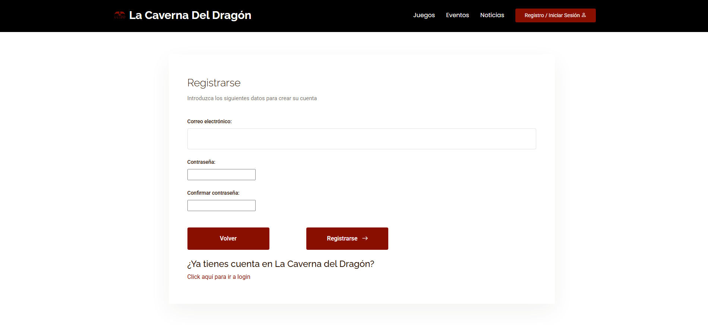


> Página de registro en el cual el usuario anónimo podrá introducir sus datos para poder crear una cuenta y si ya tiene cuenta puede redirigirse a iniciar sesión

#### **4. Página Perfil / Profile**
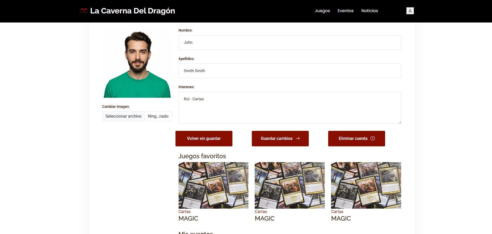


> Página del perfil del usuario registrado en el cual el usuario podrá modificar sus datos, ver sus eventos y noticias creadas y sus juegos favoritos

#### **5. Página Admninistrador / Admin**
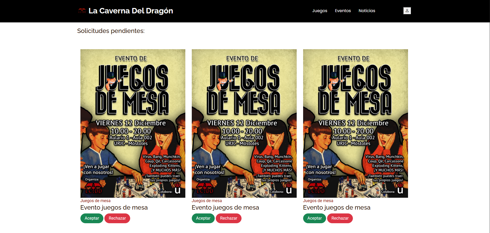


> Página del administrador en el cual un usuario administrador puede ver todas las solicitudes de eventos y noticias pendientes de validar junto a varias gráficas como las de los juegos favoritos y la de los eventos con mas inscripciones

#### **6. Página Principal Eventos / Main Events**
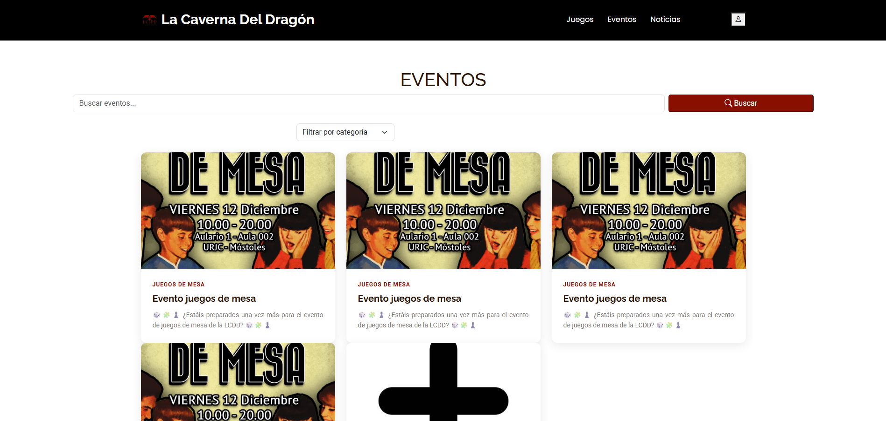


> Página principal de los eventos en el cual el usuario anónimo podrá ver todos los eventos realizados y a realizar de la asociación, junto con un buscador para filtrar eventos

#### **7. Página Principal Noticias / Main News**
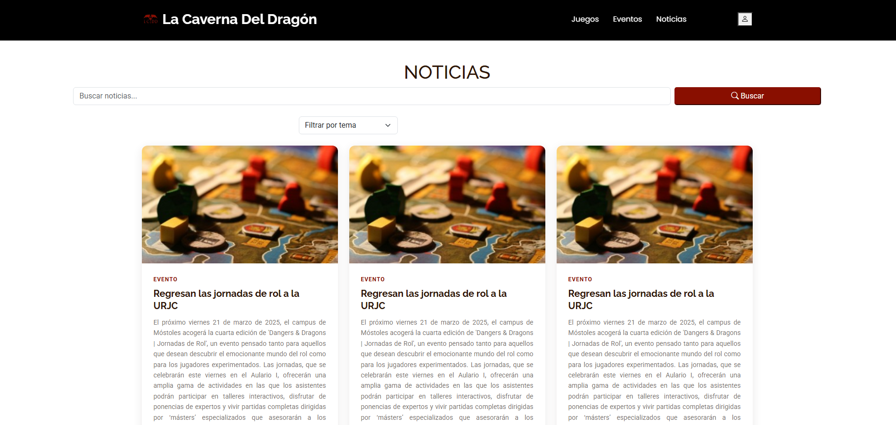


> Página principal de las noticias en el cual el usuario anónimo podrá ver todas las noticias publicadas, junto con un buscador para filtrar noticias

#### **8. Página Principal Juegos / Main Game**
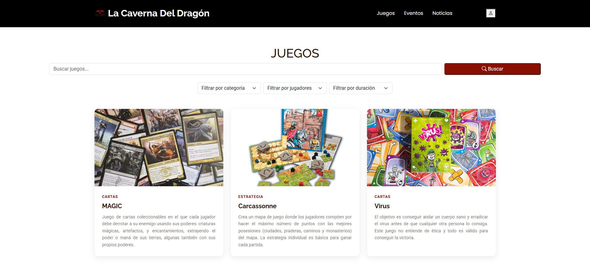


> Página principal de juegos donde el usuario anónimo podrá ver todos los juegos disponibles junto a un buscador para filtrar juegos

#### **9. Página Evento / Event**
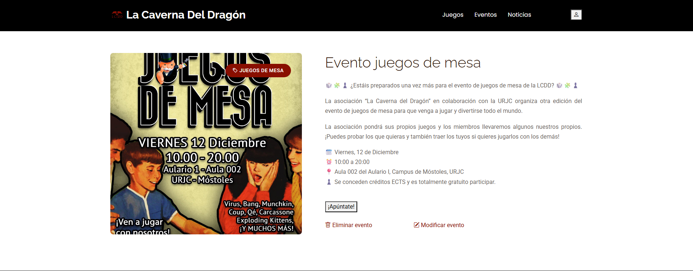


> Página de un evento en concreto en el cual el usuario anónimo o registrado podrá apuntarse

#### **10. Página Noticia / News**
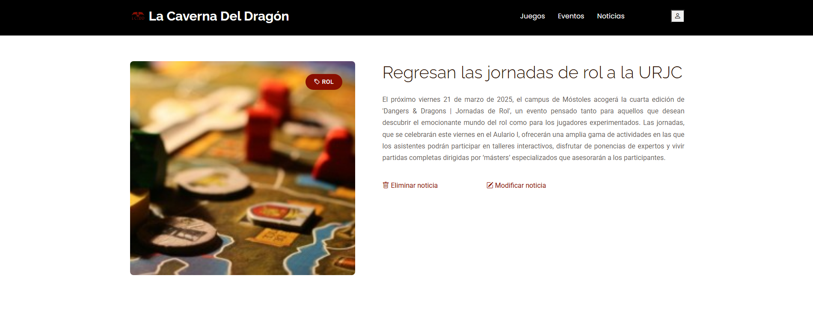


> Página de una noticia en concreto en el cual el usuario anónimo o registrado podrá leer su contenido

#### **11. Página Juego / Game**
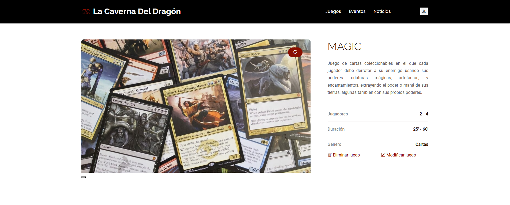


> Página de un juego en concreto en el cual el usuario anónimo podrá ver su descripción y el usuario registrado podrá añadirlo como juego favorito

#### **12. Página Modificación Eventos / Modify Events**
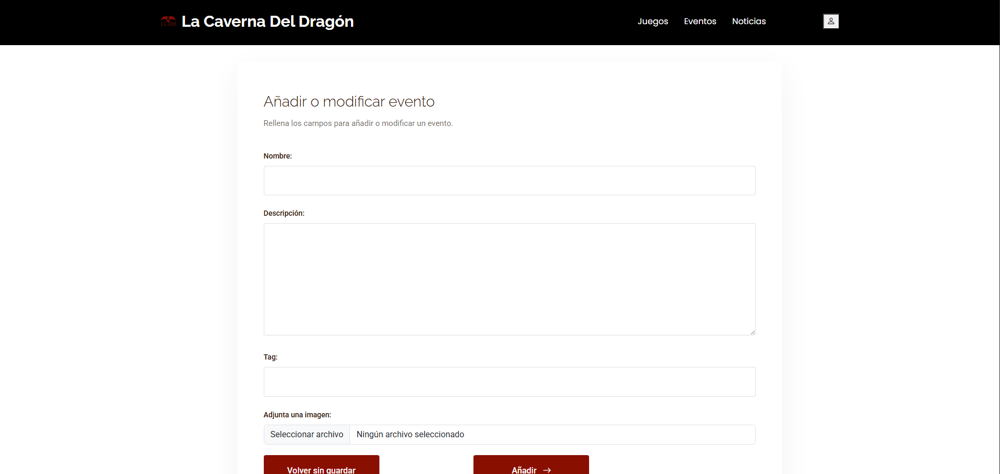


> Página de modificación o creación de eventos en el cual el usuario administrador o creador de dicho evento puede modificar o crear eventos

#### **13. Página Modificación Noticias / Modify News**
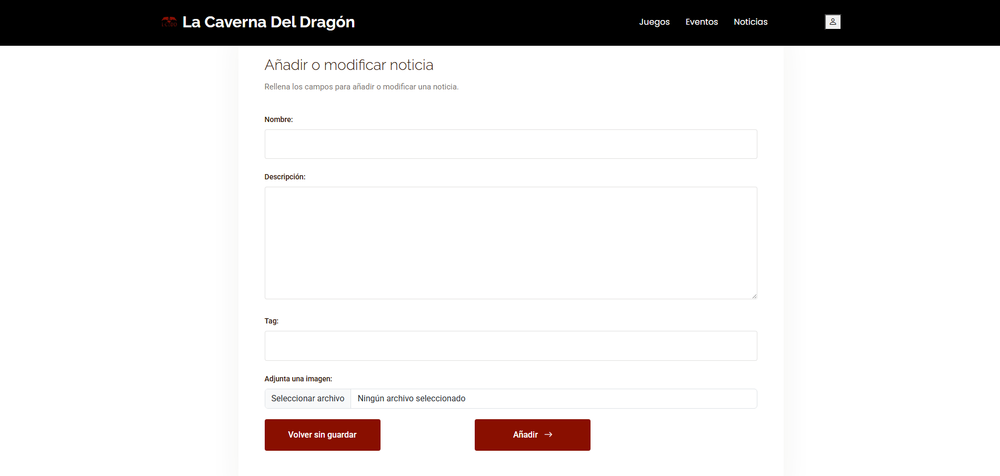


> Página de modificación o creación de noticias en el cual el usuario administrador o creador de dicha noticia puede modificar o crear noticias

#### **14. Página Modificación Juegos / Modify Game**
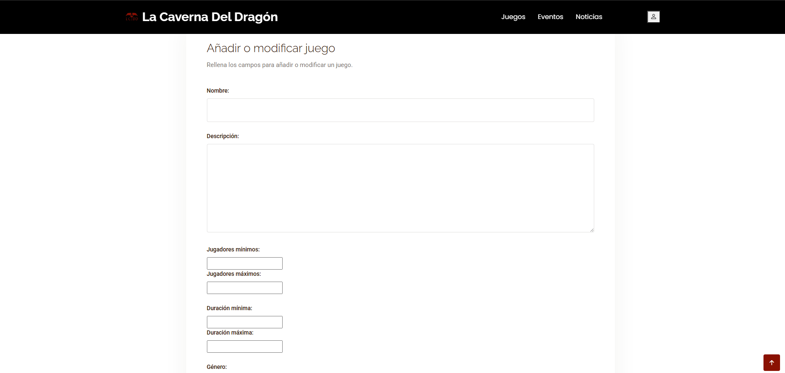


> Página de modificación o creación de juegos en el cual el usuario administrador puede modificar o añadir juegos


## 🛠 **Práctica 1: Web con HTML generado en servidor y AJAX**

### **Vídeo de Demostración**
📹 **[Enlace al vídeo en YouTube](https://www.youtube.com/watch?v=OTDyAIe8YP8)**
> Vídeo mostrando las principales funcionalidades de la aplicación web.

### **Navegación y Capturas de Pantalla**

#### **Diagrama de Navegación**

Diagrama que muestra cómo se navega entre las diferentes páginas de la aplicación:

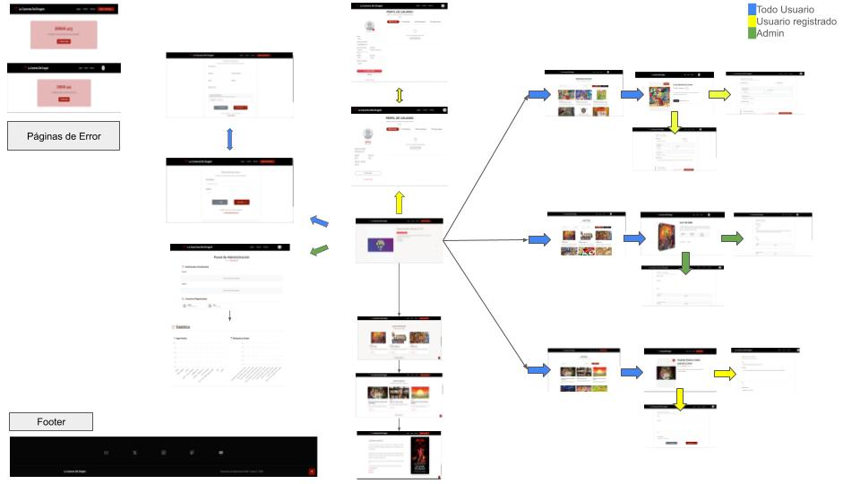

> Se mantienen los permisos que tenia cada usuario.

#### **Capturas de Pantalla Actualizadas**

#### **1. Página Principal / Home**
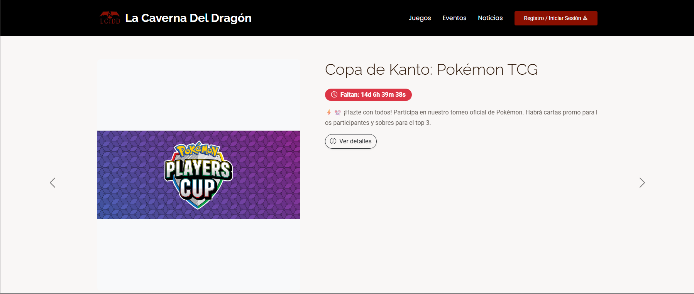


> Página de inicio que muestra el evento destacado, categorías principales y un banner promocional. Incluye barra de navegación y acceso a registro/login para usuarios no autenticados.

#### **2. Página Inicio de sesión / Login**
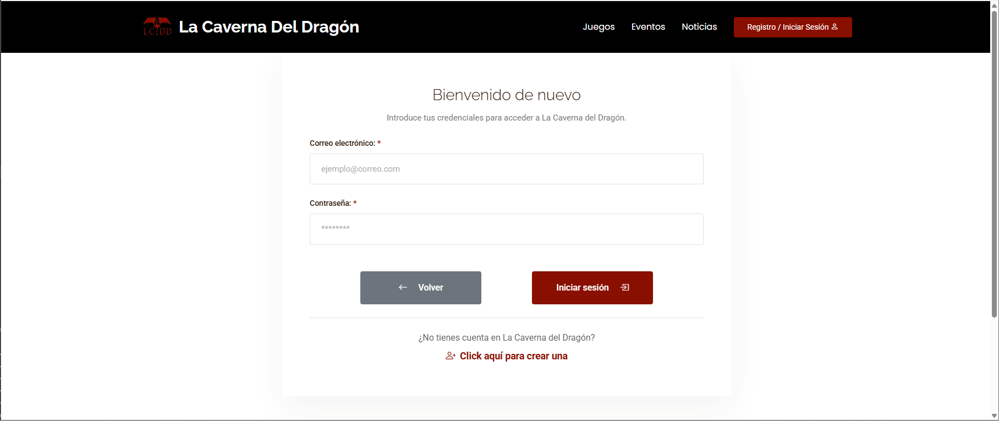


> Página de inicio de sesión en el cual el usuario anónimo podrá introducir sus credenciales para poder iniciar sesión y si no tiene una cuenta lo puede crear redirigiendolo

#### **3. Página Resgistro / Resgister**
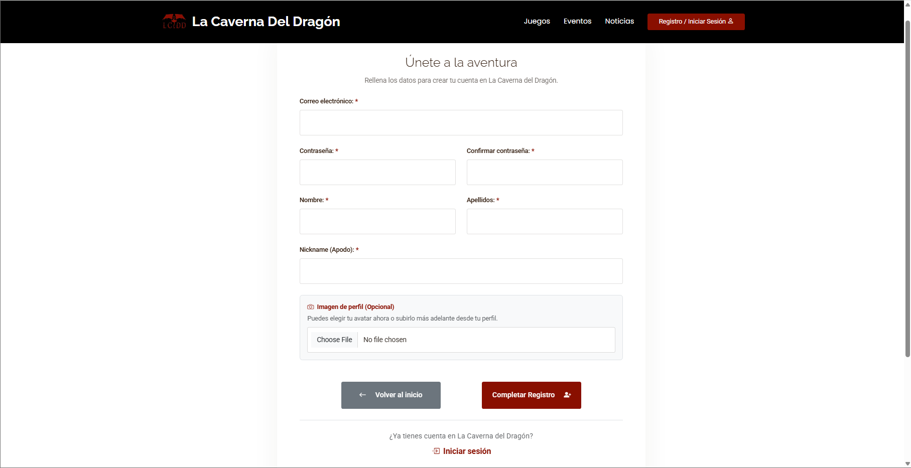


> Página de registro en el cual el usuario anónimo podrá introducir sus datos para poder crear una cuenta y si ya tiene cuenta puede redirigirse a iniciar sesión

#### **4. Página Perfil / Profile**
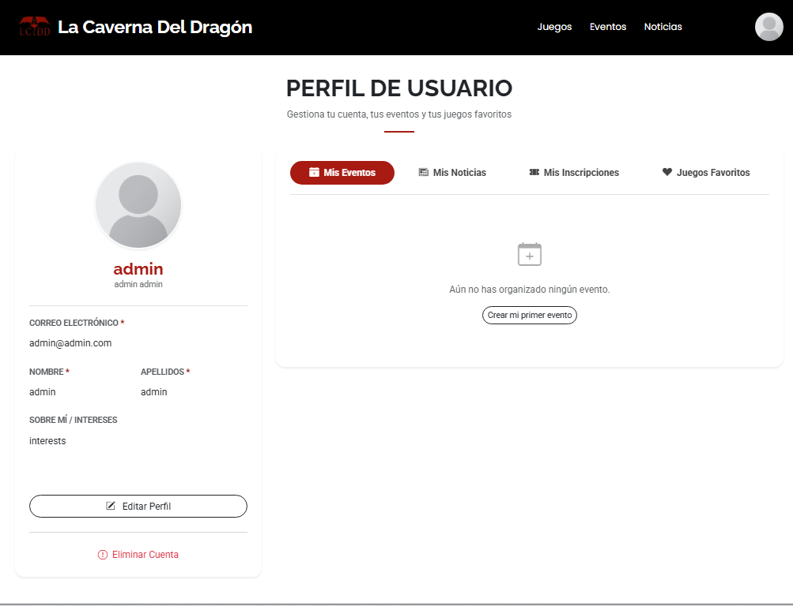


> Página del perfil del usuario registrado en el cual el usuario podrá modificar sus datos, ver sus eventos y noticias creadas y sus juegos favoritos

#### **5. Página Admninistrador / Admin**
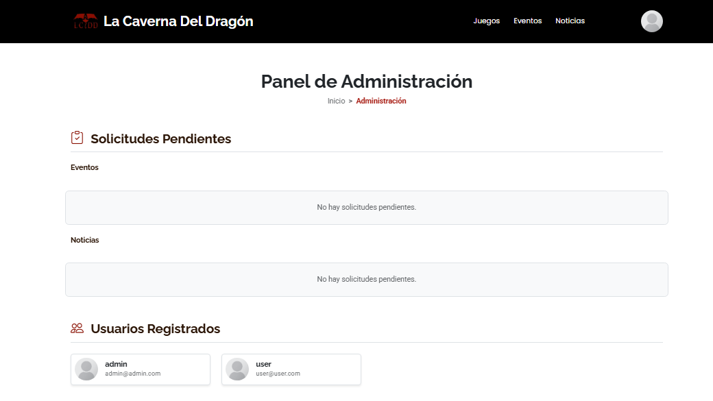


> Página del administrador en el cual un usuario administrador puede ver todas las solicitudes de eventos y noticias pendientes de validar junto a varias gráficas como las de los juegos favoritos y la de los eventos con mas inscripciones

#### **6. Página Principal Eventos/ Main Events**
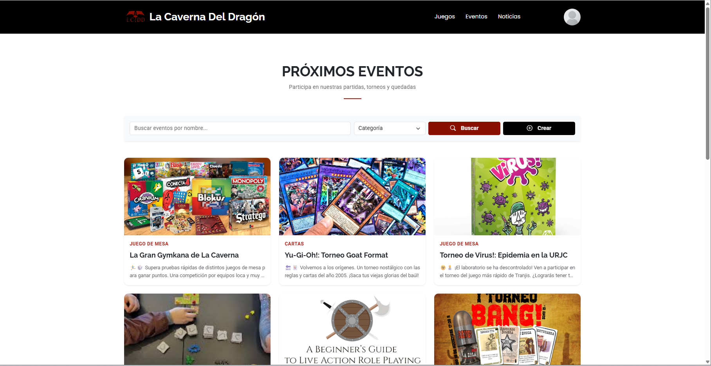


> Página principal de los eventos en el cual el usuario anónimo podrá ver todos los eventos realizados y a realizar de la asociación, junto con un buscador para filtrar eventos

#### **7. Página Principal Noticias / Main News**
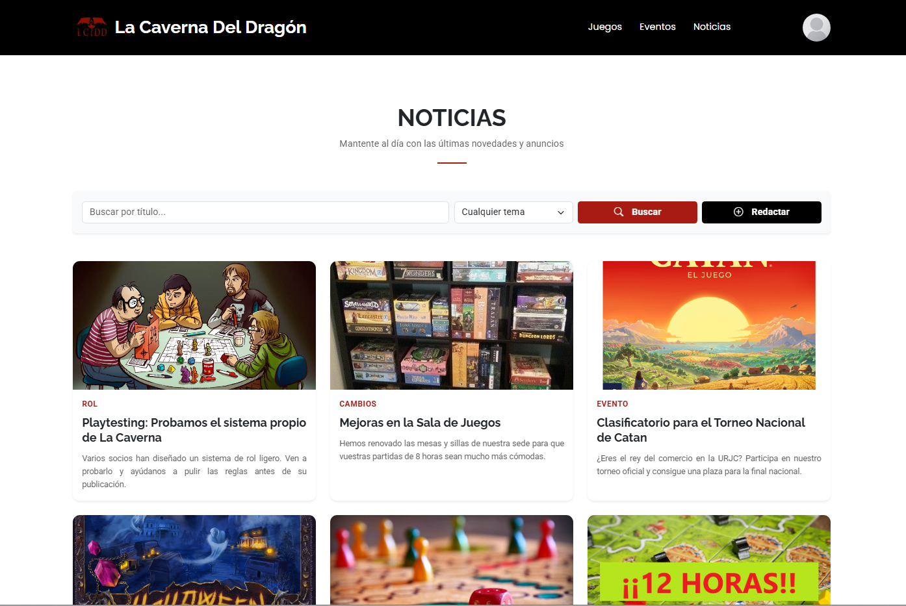


> Página principal de las noticias en el cual el usuario anónimo podrá ver todas las noticias publicadas, junto con un buscador para filtrar noticias

#### **8. Página Principal Juegos sin ser administrador / Main Game**
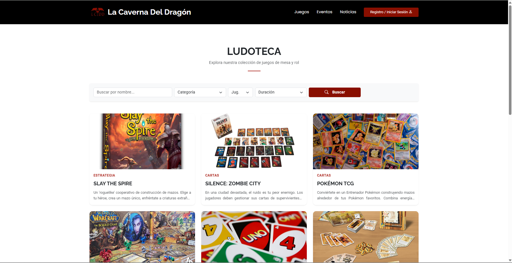


> Página principal de juegos donde el usuario anónimo podrá ver todos los juegos disponibles junto a un buscador para filtrar juegos

#### **8.1 Página Principal Juegos siendo administrador / Main Game**
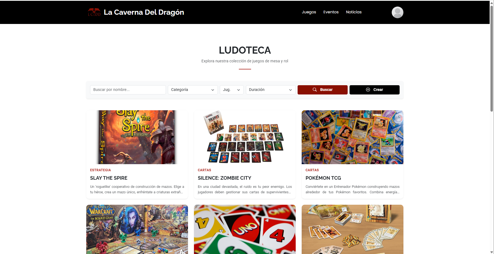


> Para los administradores, se añade un botón de añadir juego.

#### **9. Página Evento / Event**
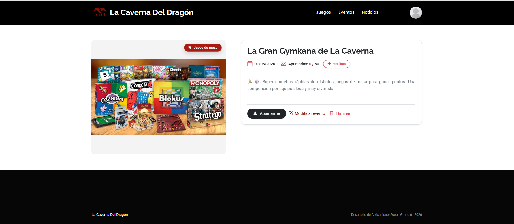


> Página de un evento en concreto en el cual el usuario anónimo o registrado podrá apuntarse

#### **10. Página Noticia / News**
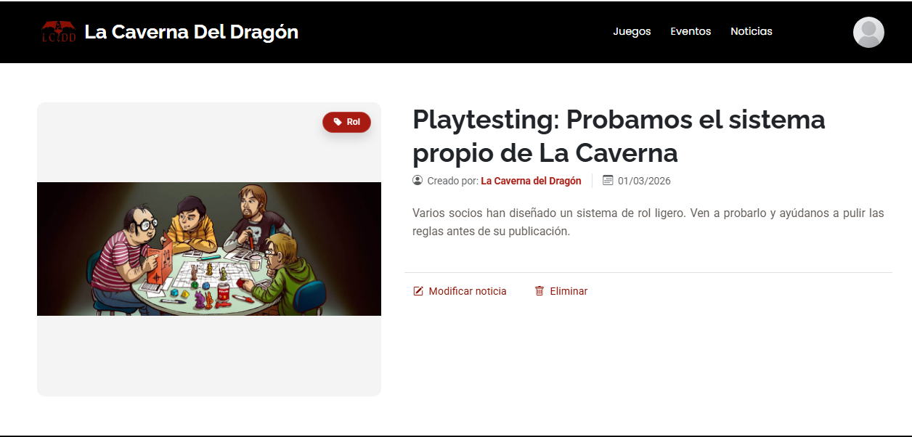


> Página de una noticia en concreto en el cual el usuario anónimo o registrado podrá leer su contenido

#### **11. Página Juego / Game**
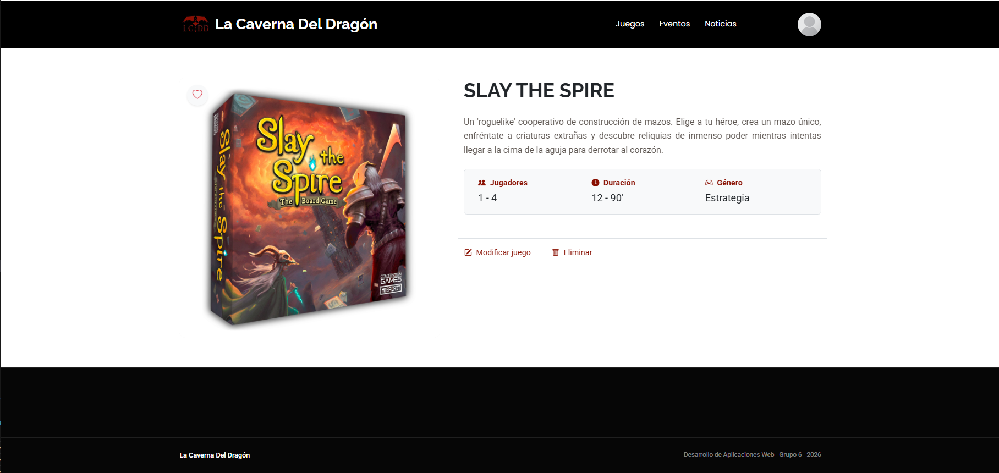


> Página de un juego en concreto en el cual el usuario anónimo podrá ver su descripción y el usuario registrado podrá añadirlo como juego favorito

#### **12. Página Modificación Eventos / Modify Events**
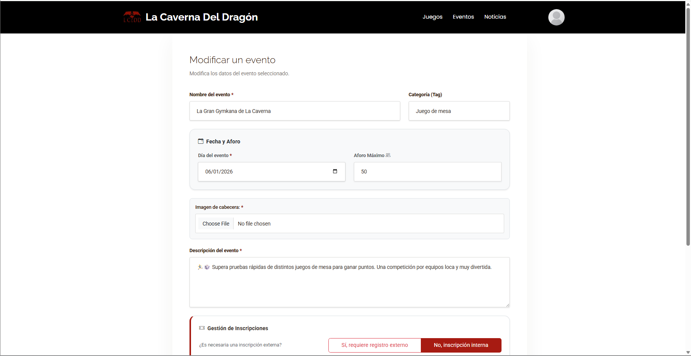


> Página de modificación o creación de eventos en el cual el usuario administrador o creador de dicho evento puede modificar o crear eventos

#### **13. Página Modificación Noticias / Modify News**
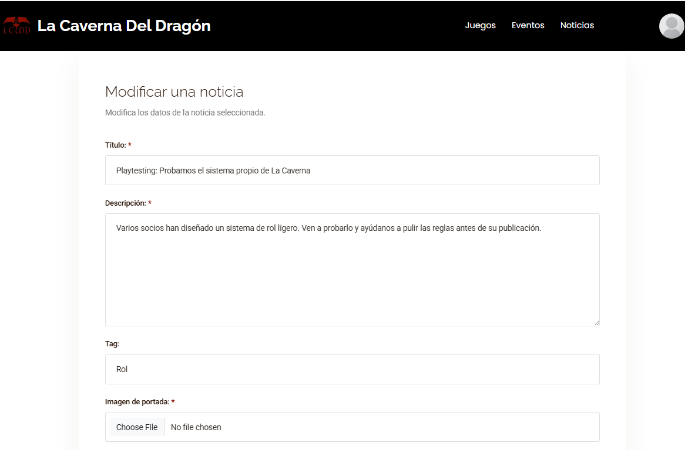


> Página de modificación o creación de noticias en el cual el usuario administrador o creador de dicha noticia puede modificar o crear noticias

#### **14. Página Modificación Juegos / Modify Game**
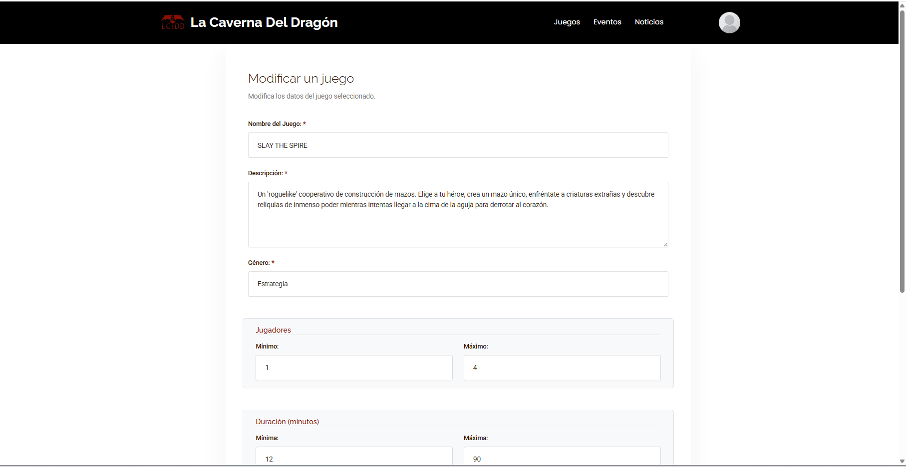


> Página de modificación o creación de juegos en el cual el usuario administrador puede modificar o añadir juegos

#### **15. Página de Error / Error**
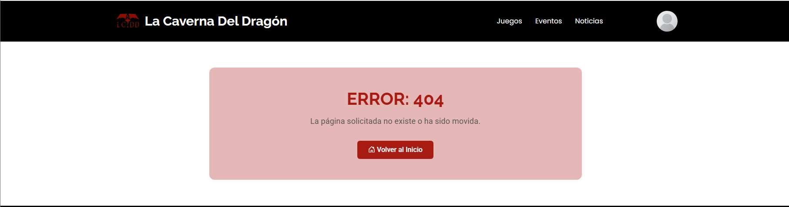


> Página de error cuya información cambia según que error ha ocurrido

### **Instrucciones de Ejecución**

#### **Requisitos Previos**
- **Java**: versión 21 o superior
- **Maven**: versión 3.8 o superior
- **MySQL**: versión 8.0 o superior
- **Git**: para clonar el repositorio

#### **Pasos para ejecutar la aplicación**

1. **Clonar el repositorio**
   ```bash
   git clone https://github.com/CodeURJC-DAW-2025-26/practica-daw-2025-26-grupo-6.git
   cd practica-daw-2025-26-grupo-6
   ```
2. **Iniciar MySQL y base de datos lcdd_daw**
   ```bash
   docker run --rm -e MYSQL_ROOT_PASSWORD=MySQLpassword \
   -e MYSQL_DATABASE=lcdd_daw -p 3306:3306 -d mysql:9.5.0
   ```

3. **Configuración de application.properties**
   Edita lcdd-daw/src/main/resources/application.properties y configura spring.mail.username y spring.mail.password. Debes cambiar también spring.datasource.password y spring.datasource.url si no corresponde con tu configuración de MySQL.
   ```properties
   # Configuración de ejemplo:
   spring.mail.username=tucorreo@gmail.com
   spring.mail.password=aaaa bbbb cccc dddd
   # Para cuentas de gmail, la contraseña debe ser una app password: https://myaccount.google.com/apppasswords
   ```

4. **Ejecutar aplicación**
   ```bash
   cd lcdd-daw
   mvn spring-boot:run
   ```
   
5. **Abrir en navegador**
   - `https://localhost:8443`

#### **Credenciales de prueba**
- **Usuario Admin**: usuario: `admin@admin.com`, contraseña: `adminpass`
- **Usuario Registrado**: usuario: `user@user.com`, contraseña: `pass`

### **Diagrama de Entidades de Base de Datos**

Diagrama mostrando las entidades, sus campos y relaciones:

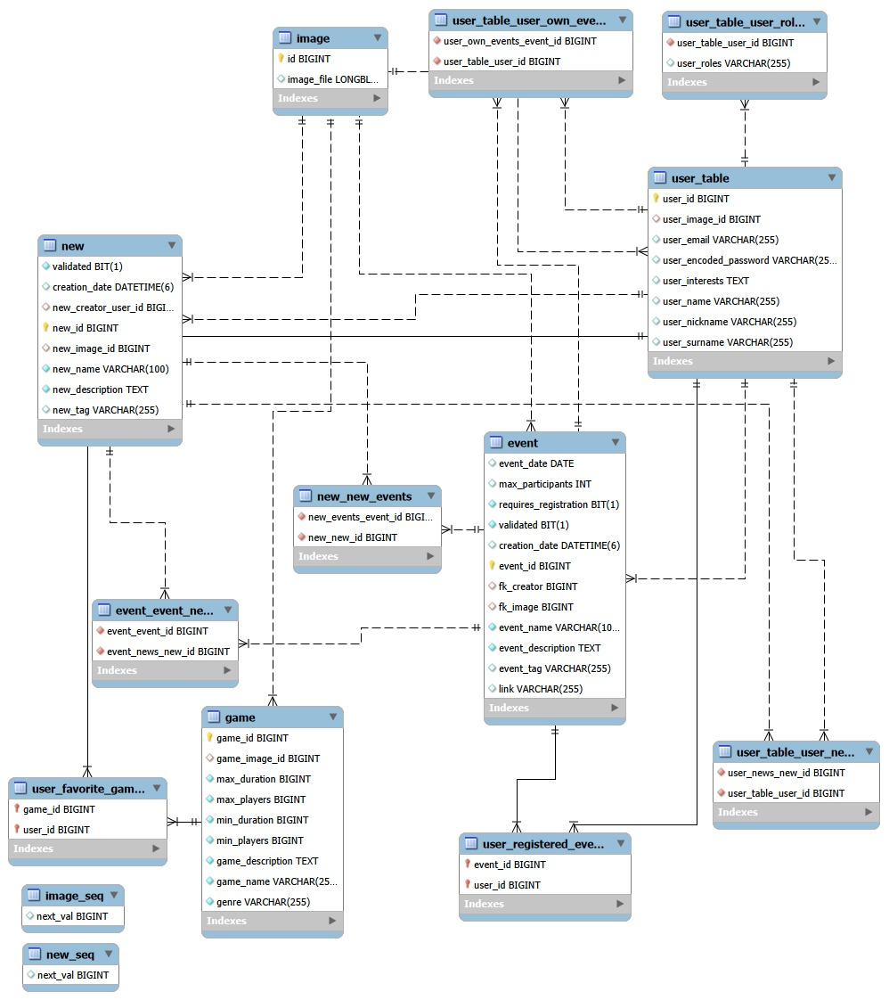

> El diagrama detalla el modelo físico de la base de datos con sus 5 tablas principales (User, Event, Game, New, Image), sus atributos y las relaciones 1:N (como el creador de una noticia) y N:M (como la inscripción de usuarios en eventos o juegos favoritos).

### **Diagrama de Clases y Templates**

Diagrama de clases de la aplicación con diferenciación por colores o secciones:

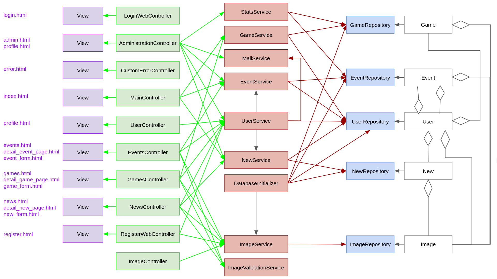

> El diagrama representa la arquitectura MVC del sistema, detallando la interacción entre las Vistas (Mustache), los Controllers que gestionan las peticiones, los Services que contienen la lógica de negocio y los Repositories que acceden a las entidades de datos.

### **Participación de Miembros en la Práctica 1**

#### **Alumno 1 - Carlos García Pérez**

Hice todas las validaciones, en front y backend de los eventos, los juegos y las noticias. También he añadido validaciones al login, al registro, y al editar datos en el perfil. He cambiado visualmente casi todas las páginas para que tengan un look más moderno y que no parezca tanto una web plana. He añadido seguridad en las validaciones, por ejemplo en las imágenes, para cubrir que solo se puedan subir archivos específicos. También he estado a cargo de ordenar y estructurar los scripts de todas las páginas. He hecho la parte de poder apuntarse a eventos, con el visor a tiempo real del aforo y su propia limitación (no te deja apuntarte si está lleno) y la posibilidad para el creador y los admins de ver la lista de apuntados y poder entrar en sus perfiles desde ahi.

| Nº    | Commits      | Files      |
|:------------: |:------------:| :------------:|
|1| [Añadidas validaciones front y back al login](https://github.com/CodeURJC-DAW-2025-26/practica-daw-2025-26-grupo-6/commit/afd532face33c8536d6da4efda2e0823091b0f96)  | [main.js](https://github.com/CodeURJC-DAW-2025-26/practica-daw-2025-26-grupo-6/blame/main/lcdd-daw/src/main/resources/static/js/main.js)   |
|2| [Añadidas validaciones front y back en juegos y arreglado el formulario de eventos](https://github.com/CodeURJC-DAW-2025-26/practica-daw-2025-26-grupo-6/commit/da4cec901b76769855620735ce229620bb7a32de)  | [EventsController.java](https://github.com/CodeURJC-DAW-2025-26/practica-daw-2025-26-grupo-6/blame/main/lcdd-daw/src/main/java/com/grupo6daw/lcdd_daw/controller/EventsController.java)  |
|3| [Añadidas validaciones front y back en eventos](https://github.com/CodeURJC-DAW-2025-26/practica-daw-2025-26-grupo-6/commit/beaf34c2bbcf61a18c181bef9951d2da8513923e) | [event_form.html](https://github.com/CodeURJC-DAW-2025-26/practica-daw-2025-26-grupo-6/blame/main/lcdd-daw/src/main/resources/templates/event_form.html)   |
|4| [Añadida la lógica de apuntarse a eventos, con toda su estructura](https://github.com/CodeURJC-DAW-2025-26/practica-daw-2025-26-grupo-6/commit/835fa81ddedb620cb787037c74ff3232dc1d46d2)  | [detail_event_page.html](https://github.com/CodeURJC-DAW-2025-26/practica-daw-2025-26-grupo-6/blame/main/lcdd-daw/src/main/resources/templates/detail_event_page.html)   |
|5| [Añadida la posibilidad de previsualizar la imagen de perfil antes de guardarla, validaciones al modificar todo el perfil y varios cambios esteticos](https://github.com/CodeURJC-DAW-2025-26/practica-daw-2025-26-grupo-6/commit/b36ff20b5a45ddcf1e0cc593277a40e730a29423)  | [ImageValidationService.java](https://github.com/CodeURJC-DAW-2025-26/practica-daw-2025-26-grupo-6/blame/main/lcdd-daw/src/main/java/com/grupo6daw/lcdd_daw/service/ImageValidationService.java)   |

---

#### **Alumno 2 - Antonio Martín Carrizosa**

Subir la plantilla elegida por el grupo al repositorio y eliminar algunos archivos que venían con la plantilla y no necesitabamos. Carrusel de próximos eventos y sección de about us de la página principal. Implementación del servicio de correos. Foto de perfil en el header. Permitir al usuario la edición de sus atributos y el borrado del usuario. Aplicar Mustache a la página de perfil de usuario para mostrar sus elementos. Añadir los atributos admin, logged y userId a todas las páginas para utilizar con Mustache. Solución de errores.

| Nº    | Commits      | Files      |
|:------------: |:------------:| :------------:|
|1| [Registro de usuarios](https://github.com/CodeURJC-DAW-2025-26/practica-daw-2025-26-grupo-6/commit/224cf472a8da80a04236edb656858dfeefe597d2)  | [MailService.java](https://github.com/CodeURJC-DAW-2025-26/practica-daw-2025-26-grupo-6/blob/main/lcdd-daw/src/main/java/com/grupo6daw/lcdd_daw/service/MailService.java)   |
|2| [Actualización y borrado de usuarios](https://github.com/CodeURJC-DAW-2025-26/practica-daw-2025-26-grupo-6/commit/b7b3b1febda0242ed31ac7419872138f39a654e7)  | [UserService.java](https://github.com/CodeURJC-DAW-2025-26/practica-daw-2025-26-grupo-6/blame/main/lcdd-daw/src/main/java/com/grupo6daw/lcdd_daw/service/UserService.java)   |
|3| [Página de perfil de usuario con mustache](https://github.com/CodeURJC-DAW-2025-26/practica-daw-2025-26-grupo-6/commit/a8623480eaecc40de42b15d75dfbd1bd2c929ced)  | [GlobalControllerAdvice.java](https://github.com/CodeURJC-DAW-2025-26/practica-daw-2025-26-grupo-6/blob/main/lcdd-daw/src/main/java/com/grupo6daw/lcdd_daw/controller/GlobalControllerAdvice.java)   |
|4| [Implementación del servicio de correos](https://github.com/CodeURJC-DAW-2025-26/practica-daw-2025-26-grupo-6/commit/40e35d279f8455357673a0200ba79956e287f32d)  | [RegisterWebController.java](https://github.com/CodeURJC-DAW-2025-26/practica-daw-2025-26-grupo-6/blame/main/lcdd-daw/src/main/java/com/grupo6daw/lcdd_daw/controller/RegisterWebController.java)   |
|5| [Mostrar próximos eventos en el carrusel](https://github.com/CodeURJC-DAW-2025-26/practica-daw-2025-26-grupo-6/commit/d23409f023de153778d17922c1d2d541b5c29c50)  | [MainController.java](https://github.com/CodeURJC-DAW-2025-26/practica-daw-2025-26-grupo-6/blame/main/lcdd-daw/src/main/java/com/grupo6daw/lcdd_daw/controller/MainController.java)   |

---

#### **Alumno 3 - Javier Cai Lin**

Implementar las funciones de la pagina del administrador que seria: implementar la funcionalidad de las gráficas de juegos favoritos y eventos con mas participantes, creación de la lista de usuarios de la aplicación, validación por parte del administrador a la hora de crear eventos y noticias nuevas y funcionalidades sueltas como la de implementar la funcion de añadir juegos favoritos de un usuario y el ocultar los botones de edicion de los perfiles que no sea del usuario que ha iniciado sesion o administrador

| Nº    | Commits      | Files      |
|:------------: |:------------:| :------------:|
|1| [Se añade la gráfica para los juegos con mas favoritos](https://github.com/CodeURJC-DAW-2025-26/practica-daw-2025-26-grupo-6/commit/d0faf5f6822f81af011612bcf3faeb20b962196e)  | [admin.html](https://github.com/CodeURJC-DAW-2025-26/practica-daw-2025-26-grupo-6/blame/main/lcdd-daw/src/main/resources/templates/admin.html)   |
|2| [Se añade la gráfica para los eventos con mas participantes](https://github.com/CodeURJC-DAW-2025-26/practica-daw-2025-26-grupo-6/commit/b5f656c23c73100f9464c218e827c29e6640e383)  | [AdministrationController.java](https://github.com/CodeURJC-DAW-2025-26/practica-daw-2025-26-grupo-6/blame/main/lcdd-daw/src/main/java/com/grupo6daw/lcdd_daw/controller/AdministrationController.java)   |
|3| [Implementado la funcionalidad de solo mostrar los eventos validados al público y los no validados en la pagina de administrador](https://github.com/CodeURJC-DAW-2025-26/practica-daw-2025-26-grupo-6/commit/f0d45a70079127e8f5d76e5b71524f962e4c9c69)  | [UserController.java](https://github.com/CodeURJC-DAW-2025-26/practica-daw-2025-26-grupo-6/blame/main/lcdd-daw/src/main/java/com/grupo6daw/lcdd_daw/controller/UserController.java)   |
|4| [Implementado la funcionalidad de solo mostrar las notiicas validadas al público y las no validadas en la pagina de administrador](https://github.com/CodeURJC-DAW-2025-26/practica-daw-2025-26-grupo-6/commit/ac6bb5b72aab14e40f5b18683f266109df8a0c35)  | [EventsController.java](https://github.com/CodeURJC-DAW-2025-26/practica-daw-2025-26-grupo-6/blame/main/lcdd-daw/src/main/java/com/grupo6daw/lcdd_daw/controller/EventsController.java)   |
|5| [Implementado la lista de usuarios registrados en la pagina de administrador](https://github.com/CodeURJC-DAW-2025-26/practica-daw-2025-26-grupo-6/commit/32fb70885150892eaaa6b9537ccc871ff8f12f31)  | [profile.html](https://github.com/CodeURJC-DAW-2025-26/practica-daw-2025-26-grupo-6/blame/main/lcdd-daw/src/main/resources/templates/profile.html)   |

---

#### **Alumno 4 - Jaime Esteban García**

Preparar la configuración inicial de Spring en el proyecto. Implementar guardado y borrado de juegos, eventos y noticias en base de datos, además de la carga de estos en la web. Adición de filtros de búsqueda en la lista de juegos, eventos y noticias. Implementación de AJAX para cargar juegos, eventos y noticias en bloques de 10 elementos. He aplicado correcciones a las plantillas con Mustache. He añadido una página de error común que sigue el estilo del resto de la web. Implementación de envío de correo cuando un se crea un evento con tag igual a uno en el que un usuario se haya apuntado.

| Nº    | Commits      | Files      |
|:------------: |:------------:| :------------:|
|1| [Adición de página de error común con estilo similar al resto de la web](https://github.com/CodeURJC-DAW-2025-26/practica-daw-2025-26-grupo-6/commit/05e9925e0d88f279618963a37eb6551b39606a1c)  | [CustomErrorController.java](https://github.com/CodeURJC-DAW-2025-26/practica-daw-2025-26-grupo-6/blob/05e9925e0d88f279618963a37eb6551b39606a1c/lcdd-daw/src/main/java/com/grupo6daw/lcdd_daw/controller/CustomErrorController.java)   |
|2| [Implementación de AJAX](https://github.com/CodeURJC-DAW-2025-26/practica-daw-2025-26-grupo-6/commit/f014b219c9ac878000c26058b9fd5efd12c9404a)  | [events.html](https://github.com/CodeURJC-DAW-2025-26/practica-daw-2025-26-grupo-6/blob/f014b219c9ac878000c26058b9fd5efd12c9404a/lcdd-daw/src/main/resources/templates/events.html)   |
|3| [Adición de filtros de búsqueda](https://github.com/CodeURJC-DAW-2025-26/practica-daw-2025-26-grupo-6/commit/b1f9d16282cf15973740f1f8621a09699c5f1f6b)  | [GameRepository.java](https://github.com/CodeURJC-DAW-2025-26/practica-daw-2025-26-grupo-6/blob/b1f9d16282cf15973740f1f8621a09699c5f1f6b/lcdd-daw/src/main/java/com/grupo6daw/lcdd_daw/repository/GameRepository.java)   |
|4| [Envío de correos cuando se crea un evento de interés del usuario](https://github.com/CodeURJC-DAW-2025-26/practica-daw-2025-26-grupo-6/commit/2b10329c0825c875e34160f5ebe8bc8c2609df4a)  | [AdministrationController.java](https://github.com/CodeURJC-DAW-2025-26/practica-daw-2025-26-grupo-6/blob/2b10329c0825c875e34160f5ebe8bc8c2609df4a/lcdd-daw/src/main/java/com/grupo6daw/lcdd_daw/controller/AdministrationController.java)   |
|5| [Adición y eliminación de juegos, eventos y noticias en bbdd](https://github.com/CodeURJC-DAW-2025-26/practica-daw-2025-26-grupo-6/commit/de1e70213dca5baabf2b9fd01b20438d0c2ac066)  | [GameController.java](https://github.com/CodeURJC-DAW-2025-26/practica-daw-2025-26-grupo-6/blob/de1e70213dca5baabf2b9fd01b20438d0c2ac066/lcdd-daw/src/main/java/com/grupo6daw/lcdd_daw/controller/GamesController.java)   |

---

#### **Alumno 5 - Anthony Lattanzi Salas**

Principalmente añadir la estructuración de mustache para los html al igual que mantener las páginas limpias y visualmente agradables. He corregido pequeños errores a lo largo de las plantillas y filtros. Mi zona principal de trabajo a side con el header y el footer al igual que cualquier arreglo del mustache.

| Nº    | Commits      | Files      |
|:------------: |:------------:| :------------:|
|1| [Adición de header y footer mediante mustache](https://github.com/CodeURJC-DAW-2025-26/practica-daw-2025-26-grupo-6/compare/de1e70213dca5baabf2b9fd01b20438d0c2ac066...37ee6e5902a0359dee1dfa4bf3a0701a5ed20d05)  | [profile.html](https://github.com/CodeURJC-DAW-2025-26/practica-daw-2025-26-grupo-6/blob/main/lcdd-daw/src/main/resources/templates/profile.html)   |
|2| [Multiple entities modified plus log out button added](https://github.com/CodeURJC-DAW-2025-26/practica-daw-2025-26-grupo-6/compare/8fe76645a1db5471bc704bc364f63a490a7102df...c35a8ce73f641e9b0665c41f9f7e7e542b973db5)  | [games.html](https://github.com/CodeURJC-DAW-2025-26/practica-daw-2025-26-grupo-6/blob/main/lcdd-daw/src/main/resources/templates/games.html)   |
|3| [Multiple mustache structures added](https://github.com/CodeURJC-DAW-2025-26/practica-daw-2025-26-grupo-6/compare/ed485a5c4a48dc78004d5bc876eb35e631d98293...27349de5b5462fb60b7e0b30d025ebf3cd627836)  | [news.html](https://github.com/CodeURJC-DAW-2025-26/practica-daw-2025-26-grupo-6/blob/main/lcdd-daw/src/main/resources/templates/news.html)   |
|4| [Social media links added and a filter problem fixed](https://github.com/CodeURJC-DAW-2025-26/practica-daw-2025-26-grupo-6/compare/02e96ca6d99d1ce22dc7b81db17a568bafd51c26...10f68e6305b8fac579e46cf88edd90520fb613a0)  | [footer.html](https://github.com/CodeURJC-DAW-2025-26/practica-daw-2025-26-grupo-6/blob/main/lcdd-daw/src/main/resources/templates/footer.html)   |
|5| [Added the first mustache structures](https://github.com/CodeURJC-DAW-2025-26/practica-daw-2025-26-grupo-6/compare/84ddf4314a8795650caa3081be5f1ba3e3973941...0dce5b1a531d6aa02d81bd41e924ea0d8055471a)  | [admin.html](https://github.com/CodeURJC-DAW-2025-26/practica-daw-2025-26-grupo-6/blob/main/lcdd-daw/src/main/resources/templates/admin.html)   |

---

## 🛠 **Práctica 2: Incorporación de una API REST a la aplicación web, despliegue con Docker y despliegue remoto**

### **Vídeo de Demostración**
📹 **[Enlace al vídeo en YouTube]()**
> Vídeo (falta) mostrando las principales funcionalidades de la aplicación web.

### **Documentación de la API REST**

#### **Especificación OpenAPI**
📄 **[Especificación OpenAPI (YAML)](backend/api-docs/api-docs.yaml)**

#### **Documentación HTML**
📖 **[Documentación API REST (HTML)](https://raw.githack.com/CodeURJC-DAW-2025-26/practica-daw-2025-26-grupo-6/main/backend/api-docs/api-docs.html)**

> La documentación de la API REST se encuentra en la carpeta `/api-docs` del repositorio. Se ha generado automáticamente con SpringDoc a partir de las anotaciones en el código Java.

### **Diagrama de Clases y Templates Actualizado**

Diagrama actualizado incluyendo los @RestController y su relación con los @Service compartidos:

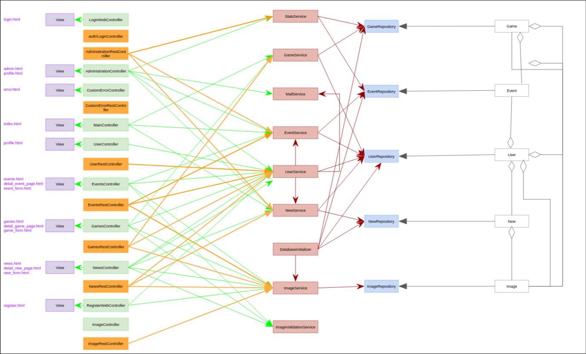

### **Instrucciones de Ejecución con Docker**

#### **Requisitos previos:**
- Docker instalado (versión 20.10 o superior)
- Docker Compose instalado (versión 2.0 o superior)

#### **Pasos para ejecutar con docker-compose:**

1. **Clonar el repositorio** (si no lo has hecho ya):
   ```bash
   git clone https://github.com/CodeURJC-DAW-2025-26/practica-daw-2025-26-grupo-6.git
   cd practica-daw-2025-26-grupo-6
   ```

2. **Acceder al directorio donde se encuentra el docker-compose.yml**:
   ```bash
   cd backend/docker
   ```

3. **Configuración de docker-compose.yml**
   ```bash
   docker compose up
   ```
   
### **Construcción de la Imagen Docker**

#### **Requisitos:**
- Docker instalado en el sistema

#### **Pasos para construir y publicar la imagen:**

1. **Navegar al directorio de Docker**:
   ```bash
   cd backend/docker
   ```

2. **Dar permisos de ejecución a los scripts**
   ```bash
   chmod u+x *.sh
   ```

3. **Ejecutar los scripts**
   ```bash
   # Construir imagen
   ./create_image.sh lcdd_daw

   # Publicar imagen
   ./publish_image.sh <add_dockerhub_username_here> lcdd_daw
   
   # Publicar imagen
   ./publish_docker-compose.sh <add_dockerhub_username_here> lcdd_daw
   ```

### **Deispliegue en Máquina Virtual**

#### **Requisitos:**
- Acceso a la máquina virtual (SSH)
- Clave privada para autenticación
- Conexión a la red correspondiente o VPN configurada

#### **Pasos para desplegar:**

1. **Conectar a la máquina virtual**:
   ```bash
   ssh -i [ruta/a/clave.key] [usuario]@[IP-o-dominio-VM]
   ```
   
   Ejemplo:
   ```bash
   ssh -i ssh-keys/app.key vmuser@10.100.139.XXX
   ```

2. **Ejecutar a través de docker compose**:
   La primera vez la variable de entorno DB_MODE debe ser create, el resto none (valor por defecto)
   ```bash
   EMAIL_PASSWORD=[gmail app token] EMAIL_USERNAME=[gmail@gmail.com] DB_MODE=[create|none] docker-compose -f oci://amartinca2023/lcdd_daw-compose up
   ```

### **URL de la Aplicación Desplegada**

🌐 **URL de acceso**: `https://[nombre-app].etsii.urjc.es:8443`

#### **Credenciales de Usuarios de Ejemplo**

| Rol | Usuario | Contraseña |
|:---|:---|:---|
| Administrador | admin@admin.com | adminpass |
| Usuario Registrado | user@user.com | pass |

### **Participación de Miembros en la Práctica 2**

#### **Alumno 1 - Carlos García Pérez**

He implementado la API REST del panel de administración, desarrollando los endpoints transaccionales para la moderación (aceptar y rechazar) de eventos y noticias, además de migrar y adaptar las rutas de estadísticas. He llevado a cabo la optimización de las consultas a la base de datos de la página principal, reemplazando filtros ineficientes en memoria por queries nativas para evitar la saturación de RAM.

| Nº    | Commits      | Files      |
|:------------: |:------------:| :------------:|
|1| [Creación de AdministrationRestController para gestionar las peticiones a la API del panel de administración](https://github.com/CodeURJC-DAW-2025-26/practica-daw-2025-26-grupo-6/commit/942571670c63e3ba704753cfc606642b2cdc13d8)  | [AdministrationRestController.java](https://github.com/CodeURJC-DAW-2025-26/practica-daw-2025-26-grupo-6/blame/main/backend/src/main/java/com/grupo6daw/lcdd_daw/controller/AdministrationRestController.java)  |
|2| [Adición de endpoints PUT y DELETE para aprobar y rechazar eventos y noticias](https://github.com/CodeURJC-DAW-2025-26/practica-daw-2025-26-grupo-6/commit/942571670c63e3ba704753cfc606642b2cdc13d8)  | [AdministrationController.java](https://github.com/CodeURJC-DAW-2025-26/practica-daw-2025-26-grupo-6/blob/main/backend/src/main/java/com/grupo6daw/lcdd_daw/controller/AdministrationController.java)   |
|3| [Migración de los endpoints de estadísticas (top juegos y eventos) desde AdministrationController al nuevo controlador REST para separar la lógica web y de API](https://github.com/CodeURJC-DAW-2025-26/practica-daw-2025-26-grupo-6/commit/942571670c63e3ba704753cfc606642b2cdc13d8)  | [EventRepository.java](https://github.com/CodeURJC-DAW-2025-26/practica-daw-2025-26-grupo-6/blame/main/backend/src/main/java/com/grupo6daw/lcdd_daw/repository/EventRepository.java)   |
|4| [Estandarización de los endpoints REST para seguir la arquitectura del proyecto utilizando ResponseEntity](https://github.com/CodeURJC-DAW-2025-26/practica-daw-2025-26-grupo-6/commit/942571670c63e3ba704753cfc606642b2cdc13d8)  | [MainController.java](https://github.com/CodeURJC-DAW-2025-26/practica-daw-2025-26-grupo-6/blob/main/backend/src/main/java/com/grupo6daw/lcdd_daw/controller/MainController.java)   |
|5| [Reemplazo del filtrado y limitación en memoria (Stream) en MainController por una consulta directa y optimizada a la base de datos en EventRepository](https://github.com/CodeURJC-DAW-2025-26/practica-daw-2025-26-grupo-6/commit/8d5d488f90b6a87925fc074213ccea8e0dbef39e)  | [EventService.java](https://github.com/CodeURJC-DAW-2025-26/practica-daw-2025-26-grupo-6/blame/main/backend/src/main/java/com/grupo6daw/lcdd_daw/service/EventService.java)   |

---

#### **Alumno 2 - Antonio Martín Carrizosa**

Gestión de usuarios: login, creación (registro), modificación, borrado y consulta. Solución de errores en el código y el docker. Instrucciones de uso en el readme. Subir archivo de configuración para que todos utilicemos el mismo estilo al guardar. Añadir la configuración de seguridad para la API. 

| Nº    | Commits      | Files      |
|:------------: |:------------:| :------------:|
|1| [PUT y POST para /users](https://github.com/CodeURJC-DAW-2025-26/practica-daw-2025-26-grupo-6/commit/6cf221cda37cc64196db1e877f7eec5e0ef689be)  | [UsersRestController.java](https://github.com/CodeURJC-DAW-2025-26/practica-daw-2025-26-grupo-6/blob/main/backend/src/main/java/com/grupo6daw/lcdd_daw/controller/UsersRestController.java)   |
|2| [GET para /users y /users/{id}](https://github.com/CodeURJC-DAW-2025-26/practica-daw-2025-26-grupo-6/commit/6c366aa9197b1a4350bd21f07eb9e3b306ab395d)  | [UserService.java](https://github.com/CodeURJC-DAW-2025-26/practica-daw-2025-26-grupo-6/blob/main/backend/src/main/java/com/grupo6daw/lcdd_daw/service/UserService.java)   |
|3| [añadir GET y PUT para las imágenes de los usuarios](https://github.com/CodeURJC-DAW-2025-26/practica-daw-2025-26-grupo-6/commit/a3d591773216c609c18cf5e7a28f6207c22c0b97)  | [RegisterWebController.java](https://github.com/CodeURJC-DAW-2025-26/practica-daw-2025-26-grupo-6/blob/main/backend/src/main/java/com/grupo6daw/lcdd_daw/controller/RegisterWebController.java)   |
|4| [cambio del docker compose para permitir variables de entorno](https://github.com/CodeURJC-DAW-2025-26/practica-daw-2025-26-grupo-6/commit/df63a362320c3be806141eda5c6b01eaf27c2a59)  | [UserController.java](https://github.com/CodeURJC-DAW-2025-26/practica-daw-2025-26-grupo-6/blob/main/backend/src/main/java/com/grupo6daw/lcdd_daw/controller/UserController.java)   |
|5| [Configuración de seguridad para la API](https://github.com/CodeURJC-DAW-2025-26/practica-daw-2025-26-grupo-6/commit/e8a3593b7901f55344f13f38e035d272beee91a4)  | [SecurityConfig.java](https://github.com/CodeURJC-DAW-2025-26/practica-daw-2025-26-grupo-6/blob/main/backend/src/main/java/com/grupo6daw/lcdd_daw/security/SecurityConfig.java)   |

---

#### **Alumno 3 - Javier Cai Lin**

Mover la logica de los controller a service de Games, Events y News y de implementar que se pueda apuntar un usuario a un evento y luego desapuntarse de dicho evento

| Nº    | Commits      | Files      |
|:------------: |:------------:| :------------:|
|1| [Mover la logica de los controller a service de Games](https://github.com/CodeURJC-DAW-2025-26/practica-daw-2025-26-grupo-6/commit/c2e10d81eba70f8a6afb2458d103cd5d136e06c8)  | [EventsRestController](https://github.com/CodeURJC-DAW-2025-26/practica-daw-2025-26-grupo-6/blame/main/backend/src/main/java/com/grupo6daw/lcdd_daw/controller/EventsRestController.java)   |
|2| [Mover la logica de los controller a service de Events](https://github.com/CodeURJC-DAW-2025-26/practica-daw-2025-26-grupo-6/commit/7a3dfdb8bccf91f9fc13feb7d886ec18f83625e5)  | [EventService](https://github.com/CodeURJC-DAW-2025-26/practica-daw-2025-26-grupo-6/blame/main/backend/src/main/java/com/grupo6daw/lcdd_daw/service/EventService.java)   |
|3| [Mover la logica de los controller a service de News](https://github.com/CodeURJC-DAW-2025-26/practica-daw-2025-26-grupo-6/commit/6a37d4bad455da4e3dfd1c9fb4f357b7b872e27f)  | [GamesRestController](https://github.com/CodeURJC-DAW-2025-26/practica-daw-2025-26-grupo-6/blame/main/backend/src/main/java/com/grupo6daw/lcdd_daw/controller/GamesRestController.java)   |
|4| [Usuarios poder apuntarse a evento](https://github.com/CodeURJC-DAW-2025-26/practica-daw-2025-26-grupo-6/commit/dcc2c5ba1a45dc28a1a2da4a09b74620404869b5)  | [GameService](https://github.com/CodeURJC-DAW-2025-26/practica-daw-2025-26-grupo-6/blame/main/backend/src/main/java/com/grupo6daw/lcdd_daw/service/GameService.java)   |
|5| [Usuarios poder desapuntarse de evento](https://github.com/CodeURJC-DAW-2025-26/practica-daw-2025-26-grupo-6/commit/89569147b97dc3f3b7cf065e29af078e9301207c)  | [NewsRestController](https://github.com/CodeURJC-DAW-2025-26/practica-daw-2025-26-grupo-6/blame/main/backend/src/main/java/com/grupo6daw/lcdd_daw/controller/NewsRestController.java)   |

---

#### **Alumno 4 - Jaime Esteban García**

He implementado la creación, modificación, borrado y consulta de las entidades Games, Events y News, así como sus controles por rol y por dueño. He añadido los filtros de búsqueda de las mismas entidades, así como la función de dar favorito a juegos. Adición de JSON para mostrar errores. He generado la mayor parte de la colección de peticiones de Postman y generado la documentación de la API.

| Nº    | Commits      | Files      |
|:------------: |:------------:| :------------:|
|1| [Adición, borrado, modificación y consulta de juegos](https://github.com/CodeURJC-DAW-2025-26/practica-daw-2025-26-grupo-6/commit/5d93c87f9f96aee16710e7e801a76146bbcc4469)  | [GameRestController.java](https://github.com/CodeURJC-DAW-2025-26/practica-daw-2025-26-grupo-6/blob/5d93c87f9f96aee16710e7e801a76146bbcc4469/backend/src/main/java/com/grupo6daw/lcdd_daw/controller/GamesRestController.java)   |
|2| [Adición, borrado, modificación y consulta de eventos](https://github.com/CodeURJC-DAW-2025-26/practica-daw-2025-26-grupo-6/commit/02e6315bb83963af3632b381d286babe991d13b8)  | [EventsRestController.java](https://github.com/CodeURJC-DAW-2025-26/practica-daw-2025-26-grupo-6/blob/02e6315bb83963af3632b381d286babe991d13b8/backend/src/main/java/com/grupo6daw/lcdd_daw/controller/EventsRestController.java)   |
|3| [Adición, borrado, modificación y consulta de noticias](https://github.com/CodeURJC-DAW-2025-26/practica-daw-2025-26-grupo-6/commit/6ab879848f22d77feee95869429a0b6404990d50)  | [NewsRestController.java](https://github.com/CodeURJC-DAW-2025-26/practica-daw-2025-26-grupo-6/blob/main/backend/src/main/java/com/grupo6daw/lcdd_daw/controller/NewsRestController.java)   |
|4| [Generación de errores con JSON](https://github.com/CodeURJC-DAW-2025-26/practica-daw-2025-26-grupo-6/commit/60d214f03eda47394d63d05342765be395db71ae)  | [CustomErrorRestController.java](https://github.com/CodeURJC-DAW-2025-26/practica-daw-2025-26-grupo-6/blob/60d214f03eda47394d63d05342765be395db71ae/backend/src/main/java/com/grupo6daw/lcdd_daw/controller/CustomErrorRestController.java)   |
|5| [Limitación de edición y borrado de eventos y noticias a los dueños y administradores](https://github.com/CodeURJC-DAW-2025-26/practica-daw-2025-26-grupo-6/commit/4d4abfc8850ad6adba11b7b0174ad6df1bef01c9)  | [NewsRestController.java](https://github.com/CodeURJC-DAW-2025-26/practica-daw-2025-26-grupo-6/blob/4d4abfc8850ad6adba11b7b0174ad6df1bef01c9/backend/src/main/java/com/grupo6daw/lcdd_daw/controller/NewsRestController.java)   |

#### **Alumno 5 - [Anthony Lattanzi Salas]**

He creado las funciones para generar errores con JSON y resuelto algunos problemas.

| Nº    | Commits      | Files      |
|:------------: |:------------:| :------------:|
|1| [JSON para errores](https://github.com/CodeURJC-DAW-2025-26/practica-daw-2025-26-grupo-6/commit/3d0ef7c81740080b67ac239e57e386bcdcf456bf#diff-7e9f782c16059d3a6a7df68ae8ca947fe1d45ed3aad55320789cfe2286fce34e)  | [CustomerErrorRestController.java](backend/src/main/java/com/grupo6daw/lcdd_daw/controller/CustomErrorRestController.java)   |
|2| [Solucionado un problema en el que los gráficos de la administración no aparecían](https://github.com/CodeURJC-DAW-2025-26/practica-daw-2025-26-grupo-6/commit/db45e0e78d9e2de201eee8819d2a2bff80e81722)  | [AdministrationController.java](backend/src/main/java/com/grupo6daw/lcdd_daw/controller/AdministrationController.java)   |
|3| [Algunos permisos de acceso a rutas](https://github.com/CodeURJC-DAW-2025-26/practica-daw-2025-26-grupo-6/commit/9aff8fff45b0011d66b8a6775ff422f8d7e92965)  | [SecurityConfig.java](backend/src/main/java/com/grupo6daw/lcdd_daw/security/SecurityConfig.java)   |
|4| [-](URL_commit_4)  | [-](URL_archivo_4)   |
|5| [-](URL_commit_5)  | [-](URL_archivo_5)   |
---

## 🛠 **Práctica 3: Implementación de la web con arquitectura SPA**

### **Vídeo de Demostración**
📹 **[Enlace al vídeo en YouTube](https://www.youtube.com/watch?v=M24LtLZZhWg)**
> Vídeo mostrando las principales funcionalidades de la aplicación web.

### **Preparación del Entorno de Desarrollo**

#### **Requisitos Previos**
- **Node.js**: versión 18.x o superior
- **npm**: versión 9.x o superior (se instala con Node.js)
- **Git**: para clonar el repositorio

#### **Pasos para configurar el entorno de desarrollo**

1. **Instalar Node.js y npm**
   
   Descarga e instala Node.js desde [https://nodejs.org/](https://nodejs.org/)
   
   Verifica la instalación:
   ```bash
   node --version
   npm --version
   ```

2. **Clonar el repositorio** (si no lo has hecho ya)
   ```bash
   git clone https://github.com/CodeURJC-DAW-2025-26/practica-daw-2025-26-grupo-6.git
   cd practica-daw-2025-26-grupo-6/
   ```

3. **Navegar a la carpeta del proyecto React**
   ```bash
   cd frontend
   ```

4. **Instalar las dependencias**
   ```bash
   npm install
   ```
   
5. **Ejecutar el proyecto React en modo desarrollo**
   ```bash
   npm run dev
   ```

### **Diagrama de Clases y Templates de la SPA**

Diagrama mostrando los componentes React, hooks personalizados, servicios y sus relaciones:

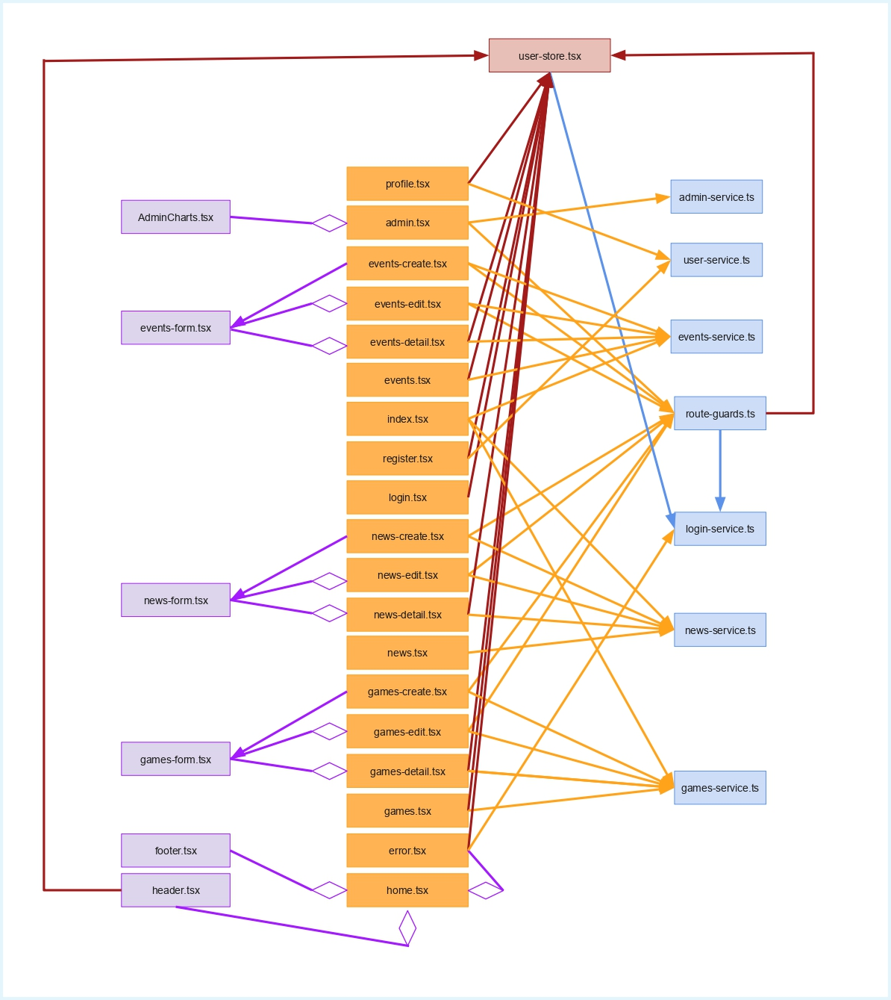

### **Participación de Miembros en la Práctica 3**

#### **Alumno 1 - Carlos García Pérez**

En el cliente SPA, he migrado y adaptado toda la lógica para apuntarse y desapuntarse a eventos, solucionando problemas de parpadeo en la interfaz mediante la aplicación del patrón Stale-While-Revalidate en el estado global (Zustand). También he arreglado el enrutamiento del modal de la lista de asistentes para asegurar la navegación absoluta a los perfiles. Además, he desarrollado un sistema dinámico para capturar y mostrar los errores reales devueltos por la API REST en los formularios (Eventos, Noticias y Juegos), implementando validaciones personalizadas de rangos y fechas sincronizadas entre HTML5 y React, y añadiendo spinners para bloquear envíos dobles y mejorar la UX.

| Nº    | Commits      | Files      |
|:------------: |:------------:| :------------:|
|1| [Implementación de la lógica SPA para apuntarse/desapuntarse a eventos y corrección del enrutamiento del modal de asistentes](https://github.com/CodeURJC-DAW-2025-26/practica-daw-2025-26-grupo-6/commit/8bc5431ae7a3d216f69b0c9b90021fe1a5407322)  | [events-service.ts](https://github.com/CodeURJC-DAW-2025-26/practica-daw-2025-26-grupo-6/blame/8bc5431ae7a3d216f69b0c9b90021fe1a5407322/frontend/app/services/events-service.ts) |
|2| [Implementación de captura dinámica de errores de validación desde la API REST en creación/edición](https://github.com/CodeURJC-DAW-2025-26/practica-daw-2025-26-grupo-6/commit/5a581994989934edb43c223c0317db7fb0912ef4)  | [events-form.tsx](https://github.com/CodeURJC-DAW-2025-26/practica-daw-2025-26-grupo-6/blame/5a581994989934edb43c223c0317db7fb0912ef4/frontend/app/components/events-form.tsx)   |
|3| [Integración de Docker Multi-stage build (Node.js + Spring Boot) para servir SPA](https://github.com/CodeURJC-DAW-2025-26/practica-daw-2025-26-grupo-6/commit/105efc831d6daf4beab90efa3c48b8b088ff2cc5)  | [Dockerfile](https://github.com/CodeURJC-DAW-2025-26/practica-daw-2025-26-grupo-6/blame/105efc831d6daf4beab90efa3c48b8b088ff2cc5/backend/docker/Dockerfile)   |
|4| [Corrección de UX en Zustand evitando borrado de sesión al recargar datos del usuario (Stale-While-Revalidate)](https://github.com/CodeURJC-DAW-2025-26/practica-daw-2025-26-grupo-6/commit/4c753a498d3d8bc03d22278f0ab4e73463382a0d)  | [user-store.tsx](https://github.com/CodeURJC-DAW-2025-26/practica-daw-2025-26-grupo-6/blame/4c753a498d3d8bc03d22278f0ab4e73463382a0d/frontend/app/stores/user-store.tsx)   |
|5| [Refactorización de formularios con startTransition e implementación de Spinners para bloquear peticiones asíncronas dobles](https://github.com/CodeURJC-DAW-2025-26/practica-daw-2025-26-grupo-6/commit/1548f1c704159c4915818990c396f002f07a7f21)  | [events-detail.tsx](https://github.com/CodeURJC-DAW-2025-26/practica-daw-2025-26-grupo-6/blame/1548f1c704159c4915818990c396f002f07a7f21/frontend/app/routes/events-detail.tsx)   |

---

#### **Alumno 2 - [Nombre Completo]**

[Descripción de las tareas y responsabilidades principales del alumno en el proyecto]

| Nº    | Commits      | Files      |
|:------------: |:------------:| :------------:|
|1| [Descripción commit 1](URL_commit_1)  | [Archivo1](URL_archivo_1)   |
|2| [Descripción commit 2](URL_commit_2)  | [Archivo2](URL_archivo_2)   |
|3| [Descripción commit 3](URL_commit_3)  | [Archivo3](URL_archivo_3)   |
|4| [Descripción commit 4](URL_commit_4)  | [Archivo4](URL_archivo_4)   |
|5| [Descripción commit 5](URL_commit_5)  | [Archivo5](URL_archivo_5)   |

---

#### **Alumno 3 - Javier Cai Lin**

Adaptar las funcionalidades de la pagina de administrador a react (ver noticias y eventos a validar, ver todos los usuarios registrados y ver las estadisticas de los juegos y eventos)

| Nº    | Commits      | Files      |
|:------------: |:------------:| :------------:|
|1| [Creado un nuevo metodo en AdminRestController para obtener noticias y eventos a validar](backend/src/main/java/com/grupo6daw/lcdd_daw/controller/AdministrationRestController.java)  | [admin.tsx](https://github.com/CodeURJC-DAW-2025-26/practica-daw-2025-26-grupo-6/blob/main/frontend/app/routes/admin.tsx)   |
|2| [Se crea admin-service.ts en el frontend](https://github.com/CodeURJC-DAW-2025-26/practica-daw-2025-26-grupo-6/commit/65f0e0c2e1f316227b85a91675e8b6f2270047f0)  | [admin-service.ts](https://github.com/CodeURJC-DAW-2025-26/practica-daw-2025-26-grupo-6/blob/main/frontend/app/services/admin-service.ts)   |
|3| [Se crea admin.tsx y adminchart.tsx](https://github.com/CodeURJC-DAW-2025-26/practica-daw-2025-26-grupo-6/commit/369b731f77641dc97f4f63a9df00cdc0348400f7)  | [AdminCharts.tsx](https://github.com/CodeURJC-DAW-2025-26/practica-daw-2025-26-grupo-6/blob/main/frontend/app/components/AdminCharts.tsx)   |
|4| [Arreglo del metodo que mostraba en la grafica datos de eventos sin validar](https://github.com/CodeURJC-DAW-2025-26/practica-daw-2025-26-grupo-6/commit/44550032ac239837cfe9572cb7c48778c0e99aed)  | [AdministrationRestController.java‎](https://github.com/CodeURJC-DAW-2025-26/practica-daw-2025-26-grupo-6/blob/main/backend/src/main/java/com/grupo6daw/lcdd_daw/controller/AdministrationRestController.java)   |
|5| [Cambio en el formato de la alerta en la pagina de admin para que concuerde con el resto de alerts de la aplicacion](https://github.com/CodeURJC-DAW-2025-26/practica-daw-2025-26-grupo-6/commit/3f6d64c576e98b37b5d91bb5532df19464f533a1)  | [EventRepository.java](https://github.com/CodeURJC-DAW-2025-26/practica-daw-2025-26-grupo-6/blob/main/backend/src/main/java/com/grupo6daw/lcdd_daw/repository/EventRepository.java)   |

---

#### **Alumno 4 - Jaime Esteban García**

Implementación de listado de juegos, eventos y noticias, así como su carga con AJAX (botón "Cargar más"), los filtros de búsqueda y sus páginas de detalle. Implementación de creación, edición y borrado de jeugos, eventos y noticias. Implementación de control por rol y dueño para juegos, eventos y noticias. Implementación de funcionalidad para dar favorito a juegos. Implementación de página de error que sigue el estilo del resto de la web. Migración del proyecto para que se encuentre disponible tanto en la ruta :8443 como en :8443/new. Aplicación de estilos react-bootstrap a las distintas páginas. Corrección de errores.

| Nº    | Commits      | Files      |
|:------------: |:------------:| :------------:|
|1| [Listado, filtrado, cargar más y página de detalle de juegos](https://github.com/CodeURJC-DAW-2025-26/practica-daw-2025-26-grupo-6/commit/f06c737c58b2b5922b40d27473221771bf368c8c)  | [games.tsx](https://github.com/CodeURJC-DAW-2025-26/practica-daw-2025-26-grupo-6/blob/f06c737c58b2b5922b40d27473221771bf368c8c/frontend/app/routes/games.tsx)   |
|2| [Creación, edición y borrado de juegos](https://github.com/CodeURJC-DAW-2025-26/practica-daw-2025-26-grupo-6/commit/b0a792d723304f37867c39533bcb6d8a7dc62437)  | [games-form.tsx](https://github.com/CodeURJC-DAW-2025-26/practica-daw-2025-26-grupo-6/blob/b0a792d723304f37867c39533bcb6d8a7dc62437/frontend/app/components/games-form.tsx)   |
|3| [Adición y eliminado de juegos de favoritos del usuario](https://github.com/CodeURJC-DAW-2025-26/practica-daw-2025-26-grupo-6/commit/5a897f394367a9b4d43ca6170c2d3a6e9cd15e2e)  | [games-detail.tsx](https://github.com/CodeURJC-DAW-2025-26/practica-daw-2025-26-grupo-6/blob/5a897f394367a9b4d43ca6170c2d3a6e9cd15e2e/frontend/app/routes/games-detail.tsx)   |
|4| [Migración del proyecto para acceder desde :8443 y :8443/new](https://github.com/CodeURJC-DAW-2025-26/practica-daw-2025-26-grupo-6/commit/99d6967e5e7ce1de97abbd931b52fdbf762c8c74)  | [SpaRoutingConfig.java](https://github.com/CodeURJC-DAW-2025-26/practica-daw-2025-26-grupo-6/blob/99d6967e5e7ce1de97abbd931b52fdbf762c8c74/backend/src/main/java/com/grupo6daw/lcdd_daw/controller/SpaRoutingConfig.java)   |
|5| [Adición de página error con estilo similar al resto de la web](https://github.com/CodeURJC-DAW-2025-26/practica-daw-2025-26-grupo-6/commit/70e89b20e20962e7a27a1ebd0303a9e9acf2efdb)  | [root.tsx](https://github.com/CodeURJC-DAW-2025-26/practica-daw-2025-26-grupo-6/blob/70e89b20e20962e7a27a1ebd0303a9e9acf2efdb/frontend/app/root.tsx)   |

---

#### **Alumno 5 - Anthony Lattanzi Salas**

Adaptar las funcionalidades del header, footer y página inicial a react.

| Nº    | Commits      | Files      |
|:------------: |:------------:| :------------:|
|1| [Adaptado el header y el footer para React Router](https://github.com/CodeURJC-DAW-2025-26/practica-daw-2025-26-grupo-6/commit/537d677adaf29b72c5061eb55c3ea47f3161c525)  | [footer.tsx](https://github.com/CodeURJC-DAW-2025-26/practica-daw-2025-26-grupo-6/blob/main/frontend/app/components/footer.tsx)   |
|2| [Desarrollo de index.tsx](https://github.com/CodeURJC-DAW-2025-26/practica-daw-2025-26-grupo-6/commit/b8d470366bcba4e6c08769b525356d659a900b6d)  | [index.tsx](https://github.com/CodeURJC-DAW-2025-26/practica-daw-2025-26-grupo-6/blob/main/frontend/app/routes/index.tsx)   |
|3| [Añadido el menú hamburguesa del estilo movil, el menú dropdown del perfil y botón de iniciar sesión/registrarse](https://github.com/CodeURJC-DAW-2025-26/practica-daw-2025-26-grupo-6/commit/091dd89ce0d25220ecef7ef6f19ba0c3e46ab1dd)  | [header.tsx](https://github.com/CodeURJC-DAW-2025-26/practica-daw-2025-26-grupo-6/blob/main/frontend/app/components/header.tsx)   |
|4| [Añadido un spinner global](https://github.com/CodeURJC-DAW-2025-26/practica-daw-2025-26-grupo-6/commit/e6325ede06dd81ab2c218e2af9160a9f6c0bfb36)  | [root.tsx](https://github.com/CodeURJC-DAW-2025-26/practica-daw-2025-26-grupo-6/blob/main/frontend/app/root.tsx)   |
|5| [-](URL_commit_5)  | [-](URL_archivo_5)   |

